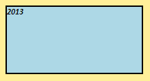
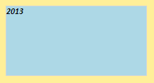

# Border.Enabled

Border.Enabled
-

**

# Border.Enabled

## Синтаксис

Enabled: Boolean

## Описание

Свойство Enabled** определяет,
 отображается ли граница.

## Комментарии

Допустимые значения:

	- true. Граница отображается;

	- false. Граница не отображается.

## Пример

Для выполнения примера необходимо наличие на html-странице ссылок на файлы сценария jquery.js, PP.js и файл стилей PP.css. Добавим в документ текстовую
 область и установим для неё новый стиль:

// Создаем текстовую область
var textArea = new PP.Ui.TextArea({
    // Задаем ширину области
    Width: 200,
    // Задаем высоту области
    Height: 100,
    // Задаем содержимое области
    Content: "2013"
});
// Создаем тень
var shadow = new PP.Shadow({
    Color: new PP.Color("#ffef99")
});
// Задаем угол падения тени
shadow.setAngle(45);
// Задаем разницу в размере тени относительно объекта
shadow.setSize(10);
// Создаем границу текстовой области
var border = new PP.Border({
    "Color": '#000000',
    "Width": 2,
    "Style": PP.BorderStyle.solid
});
// Создаем стиль для текстовой области
var style = {
    Release: new PP.Style({
        // Задаем кисть со сплошной заливкой
        Background: new PP.SolidColorBrush({
            Color: PP.Color.Colors.lightblue
        }),
        // Задаем полужирный курсив
        Font: new PP.Font({
            IsBold: true,
            IsItalic: true
        }),
        // Задаем границу
        Border: border,
        // Задаем тень
        Shadow: shadow
    })
};
// Устанавливаем стиль
textArea.setStyle(style);
// Добавляем данную область в документ
textArea.addToNode(document.body);
В результате выполнения примера в документе была создана текстовая область
 с полужирным и курсивным начертанием шрифта, а также установленными тенью
 и цветом заливки. Для границы текстовой области была установлена
 черная сплошная линия толщиной, равной 2 пикселям:

Далее скроем границу и обновим стиль текстовой области:

// Скрываем границу
border.setEnabled(false);
// Обновляем стиль текстовой области
textArea.setStyle(style);
После выполнения примера граница текстовой области была скрыта:

См. также:

[Border](Border.htm)

		Справочная
		 система на версию 10.9
		 от 18/08/2025,
		 © ООО «ФОРСАЙТ»,
