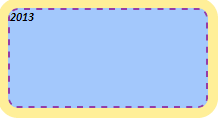
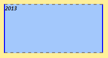

# Border.RadiusEnabled

Border.RadiusEnabled
-

# Border.RadiusEnabled

## Синтаксис

RadiusEnabled: Boolean

## Описание

Свойство RadiusEnabled устанавливает
 и возвращает признак активности закруглений границы.

## Комментарии

Допустимые значения:

	- true. Закругления
	 границы активны;

	- false. Закругления границы
	 не активны.

## Пример

Для выполнения примера необходимо наличие на html-странице ссылок на
 файлы сценария jquery.js, PP.js и файл стилей PP.css. Добавим в документ
 текстовую область и установим для неё новый стиль:

// Создаем текстовую область
var textArea = new PP.Ui.TextArea({
    // Задаем ширину области
    Width: 200,
    // Задаем высоту области
    Height: 100,
    // Задаем содержимое области
    Content: "2013"
});
// Создаем тень
var shadow = new PP.Shadow({
    Color: new PP.Color("#ffef99")
});
// Задаем угол падения тени
shadow.setAngle(45);
// Задаем разницу в размере тени относительно объекта
shadow.setSize(10);
// Создаем границу текстовой области
var border = new PP.Border({
    "Width": 2
});
// Задаем активность границы
border.setEnabled(true);
// Задаем радиус закругления
border.setRadius(10);
// Задаем стиль границы
border.setStyle(PP.BorderStyle.dashed);
// Задаем цвет границы
border.setColor(new PP.Color("#933da8"));
// Задаем активность закруглений
border.setRadiusEnabled(true);
// Создаем стиль для текстовой области
var style = {
    Release: new PP.Style({
        // Задаем кисть со сплошной заливкой
        Background: new PP.SolidColorBrush({
            Color: "#a3c8fc"
        }),
        // Задаем полужирный курсив
        Font: new PP.Font({
            IsBold: true,
            IsItalic: true
        }),
        // Задаем границу
        Border: border,
        // Задаем тень
        Shadow: shadow
    })
};
// Устанавливаем стиль
textArea.setStyle(style);
// Добавляем данную область в документ
textArea.addToNode(document.body);
В результате выполнения примера в документе была создана текстовая область
 с полужирным и курсивным начертанием шрифта, а также установленными тенью
 и цветом заливки. Для границы текстовой области была установлена штриховая
 линия толщиной, равной 2 пикселям, с радиусом скругления углов, равным
 10 пикселям:

Далее делаем закругления границы неактивными, устанавливаем новые значения
 стиля и цвета для каждой линии границы и обновляем стиль текстовой области:

// Задаем активность закруглений
border.setRadiusEnabled(false);
// Задаем цвет нижней границы
border.setBottomColor(new PP.Color("#808080"));
// Задаем цвет левой границы
border.setLeftColor(new PP.Color("#0000ff"));
// Задаем цвет правой границы
border.setRightColor(new PP.Color("#0000ff"));
// Задаем цвет верхней границы
border.setTopColor(new PP.Color("#808080"));
// Задаем стиль нижней границы
border.setBottomStyle(PP.BorderStyle.dashed);
// Задаем стиль левой границы
border.setLeftStyle(PP.BorderStyle.solid);
// Задаем стиль правой границы
border.setRightStyle(PP.BorderStyle.solid);
// Задаем стиль верхней границы
border.setTopStyle(PP.BorderStyle.dashed);
// Обновляем стиль текстовой области
textArea.setStyle(style);
В результате этого действия к текстовой области был применен измененный
 стиль, в котором задано новое значение признака активности закруглений
 границы, а также новые значения цвета и стиля для каждой линии границы.
 Закругления границы текстовой области были убраны. Для левой и
 правой границ области был установлен стиль сплошной линии, для верхней
 и нижней границ области был установлен стиль штриховой линии:

См. также:

[Border](Border.htm)

		Справочная
		 система на версию 10.9
		 от 18/08/2025,
		 © ООО «ФОРСАЙТ»,
