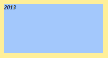
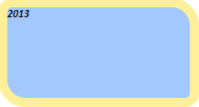

# Border.setDefault

Border.setDefault
-

# Border.setDefault

## Синтаксис

setDefault();

## Описание

Метод setDefault устанавливает
 значения параметров границы по умолчанию.

## Комментарии

Значения параметров границы по умолчанию определены в следующей таблице:

		 Свойства

		 Значение
		 по умолчанию

		 [BottomStyle](Border.BottomStyle.htm),
		 [LeftStyle](Border.LeftStyle.htm), [RightStyle](Border.RightStyle.htm),
		 [Style](Border.Style.htm), [TopStyle](Border.TopStyle.htm)
		 PP.BorderStyle.none

		 [LeftBottomRadius](Border.LeftBottomRadius.htm),
		 [LeftTopRadius](Border.LeftTopRadius.htm), [Radius](Border.Radius.htm),
		 [RightBottomRadius](Border.RightBottomRadius.htm),
		 [RightTopRadius](Border.RightTopRadius.htm)
		 0

		 [Enabled](Border.Enabled.htm), [RadiusEnabled](Border.RadiusEnabled.htm)
		 true

		 [BottomColor](Border.BottomColor.htm),
		 [Color](Border.Color.htm), [LeftColor](Border.LeftColor.htm),
		 [RightColor](Border.RightColor.htm), [TopColor](Border.TopColor.htm)
		 null

		 [Bottom](../Thickness/Thickness.Bottom.htm),
		 [Left](../Thickness/Thickness.Left.htm), [Right](../Thickness/Thickness.Right.htm),
		 [Top](../Thickness/Thickness.Top.htm), Width
		 0

По умолчанию верхняя, правая, нижняя и левая границы доступны для отображения.
 Для них доступно использование закругления, цвет не определён, радиус
 закругления и толщина равна 0,
 стиль соответствует значению PP.BorderStyle.none.

## Пример

Для выполнения примера необходимо наличие на html-странице
 ссылок на файлы сценария jquery.js, PP.js и файл стилей PP.css. Добавим в документ текстовую
 область и установим для неё новый стиль, который содержит параметры границы
 по умолчанию:

// Создаем текстовую область
var textArea = new PP.Ui.TextArea({
    // Задаем ширину области
    Width: 200,
    // Задаем высоту области
    Height: 100,
    // Задаем содержимое области
    Content: "2013"
});
// Создаем тень
var shadow = new PP.Shadow({
    Color: new PP.Color("#ffef99")
});
// Задаем угол падения тени
shadow.setAngle(45);
// Задаем разницу в размере тени относительно объекта
shadow.setSize(10);
// Создаем границу текстовой области
var border = new PP.Border({
    "Width": 2
});
// Задаем для границы параметры по умолчанию
border.setDefault();
// Создаем стиль для текстовой области
var style = {
    Release: new PP.Style({
        // Задаем кисть со сплошной заливкой
        Background: new PP.SolidColorBrush({
            Color: "#a3c8fc"
        }),
        // Задаем полужирный курсив
        Font: new PP.Font({
            IsBold: true,
            IsItalic: true
        }),
        // Задаем границу
        Border: border,
        // Устанавливаем тень
        Shadow: shadow
    })
};
// Устанавливаем стиль
textArea.setStyle(style);
// Добавляем данную область в документ
textArea.addToNode(document.body);
В результате выполнения примера в документе была создана текстовая область
 с полужирным и курсивным начертанием шрифта, а также установленными тенью
 и цветом заливки. Для границы текстовой области была указана толщина
 линии, равная 2, однако линия не была отображена, так как для параметров
 границы были применены настройки по умолчанию:

Далее устанавливаем новые значения для радиусов закругления углов границы
 и обновляем стиль текстовой области:

// Задаем правый верхний радиус закругления границы
border.setRightTopRadius(20);
// Задаем правый нижний радиус закругления границы
border.setRightBottomRadius(5);
// Задаем левый верхний радиус закругления границы
border.setLeftTopRadius(5);
// Задаем левый нижний радиус закругления границы
border.setLeftBottomRadius(20);
// Обновляем стиль текстовой области
textArea.setStyle(style);
В результате этого действия к текстовой области был применен измененный
 стиль, в котором заданы новые значения радиусов закругления границы. Для
 левого верхнего и правого нижнего углов области было установлено значение
 радиусов закругления, равное 5, а для правого верхнего и левого нижнего
 углов было установлено значение, равное 20:

См. также:

[Border](Border.htm)

		Справочная
		 система на версию 10.9
		 от 18/08/2025,
		 © ООО «ФОРСАЙТ»,
