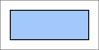

# Border.toSVGFormat

Border.toSVGFormat
-

# Border.toSVGFormat

## Синтаксис

toSVGFormat(element: SVGElement)

## Параметры

element. SVG-элемент, для которого
 требуется применить настройки границы.

## Описание

Метод toSVGFormat устанавливает
 настройки границы для указанного SVG-элемента.

## Пример

Для выполнения примера необходимо наличие на html-странице
 ссылок на файлы сценария jquery.js, PP.js и файл стилей PP.css. Создадим div-элемент и
 разместим в нём дочерний svg-элемент:

// Создаём div-элемент
var divElem = PP.createElement(document.body);
// Настраиваем стили для данного элемента
divElem.style.cssText = "width: 200px; height: 100px; border: 1px solid rgb(102, 102, 102);";
// Создаем SVG-элемент с прямоугольником
var svgElem = document.createElementNS("http://www.w3.org/2000/svg", "svg");
svgElem.setAttribute("width", "200");
svgElem.setAttribute("height", "100");
var rectElem = document.createElementNS("http://www.w3.org/2000/svg", "rect");
rectElem.setAttribute("x", "20");
rectElem.setAttribute("y", "20");
rectElem.setAttribute("width", "160");
rectElem.setAttribute("height", "60");
rectElem.setAttribute("fill", "#a3c8fc");
svgElem.appendChild(rectElem);
divElem.appendChild(svgElem);
В результате выполнения примера в документе был создан div-элемент,
 в котором был размещен прямоугольник:

Далее создаем границу и устанавливаем ее настройки для прямоугольника,
 размещенного в div-элементе:

// Создаем границу
var border = new PP.Border({
    "Color": '#000000',
    "Width": 2,
    "Style": PP.BorderStyle.solid
});
// Устанавливаем настройки границы для прямоугольника
border.toSVGFormat(rectElem);
В результате этого действия для прямоугольника, расположенного в div-элементе,
 была установлена сплошная граница черного цвета толщиной, равной 2:

См. также:

[Border](Border.htm)

		Справочная
		 система на версию 10.9
		 от 18/08/2025,
		 © ООО «ФОРСАЙТ»,
