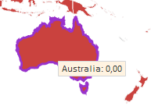

# Конструктор BorderEffect

Конструктор BorderEffect
-

# Конструктор BorderEffect

## Синтаксис

PP.BorderEffect (settings)

## Параметры

settings. JSON-объект
 со значениями свойств экземпляра класса.

## Описание

Конструктор BorderEffect создает
 экземпляр класса BorderEffect.

## Пример

Для выполнения примера предполагается наличие на странице компонента
 [MapChart](dhtmlMapChart.chm::/Components/MapChart/MapChart.htm)
 с наименованием «map» (см. «[Размещение
 карты на HTML странице](dhtmlMapChart.chm::/Components/MapChart/HTML_layout.htm)»). Для создания карты используйте
 топооснову World.svg и файл с json-настройками карты MapData_World.xml.
 Добавим обработчик события [MapChart.Loaded](dhtmlMapChart.chm::/Classes/Map/MapChart/MapChart.Loaded.htm)
 - функцию для установки эффекта подсветки границы к отдельной области
 карты:

	map.Loaded.add(function () {
	    map.getShape("AU").setEffect(new PP.BorderEffect({ BorderColor: "#9932CC", BorderThickness: 3 }))
	});

После выполнения примера при наведении курсора на область карты с идентификатором
 «AU» (Австралия), граница будет подсвечиваться следующим образом:

См. также:

[BorderEffect](BorderEffect.htm)

		Справочная
		 система на версию 10.9
		 от 18/08/2025,
		 © ООО «ФОРСАЙТ»,
