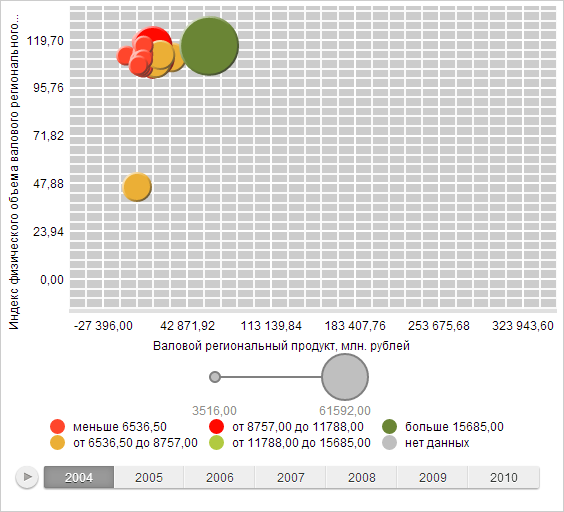

# Color.applyMatrix

Color.applyMatrix
-

# Color.applyMatrix

## Cинтаксис

applyMatrix(matrix: Array);

## Параметры

matrix. Цветовая матрица.

## Описание

Метод applyMatrix применяет
 цветовую матрицу.

## Комментарии

Структура матрицы представлена на [странице
 описания цветовой матрицы](http://www.w3.org/TR/SVG/filters.html#feColorMatrixElement) документации Консорциума Всемирной Паутины.

## Пример

Для выполнения примера необходимо наличие на html-странице компонента
 [BubbleChart](dhtmlBubbleChart.chm::/Components/BubbleChart/BubbleChart.htm)
 с наименованием «bubbleChart» (см. «[Пример
 создания компонента BubbleChart](dhtmlBubbleChart.chm::/Components/BubbleChart/BubbleChart_Example.htm)»).

Определим цветовую матрицу. Определим цвет, для которого применим матрицу.
 Определим сплошную кисть, для которой применим матрицу. Установим фон
 области диаграммы:

// Определим цветовую матрицу
var matrix = [0, 0.2, 0, 0, 0, 0, 0.2, 0, 0, 0, 0.2, 0.2, 0.02, 0, 0, 0, 0, 0, 0.2, 0, 0, 0, 0, 0, 0.5];
// Определим цвет
var color = new PP.Color(255, 0, 0);
// Применим матрицу для цвета
color.applyMatrix(matrix);
// Определим сплошную кисть
var brush = new PP.SolidColorBrush();
// Установим цвет кисти
brush.setColor(color);
// Применим матрицу для кисти
brush.applyMatrix(matrix);
// Установим фон области диаграммы
bubbleChart.getChartArea().setBackground(brush);
// Обновим диаграмму
bubbleChart.refresh();
В результате выполнения примера был изменен фоновый цвет области диаграммы:

[Color](Color.htm)

		Справочная
		 система на версию 10.9
		 от 18/08/2025,
		 © ООО «ФОРСАЙТ»,
