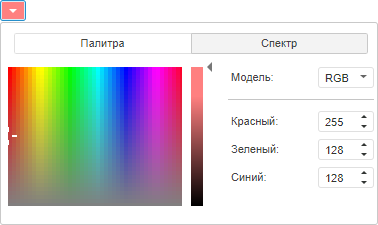

# Color.brighter

Color.brighter
-

# Color.brighter

## Синтаксис

brighter(alpha: Number);

## Параметры

alpha. Коэффициент насыщенности
 цвета. Параметр может принимать значение в интервале от 0 (наиболее насыщенный
 цвет) до 1 (наименее насыщенный цвет).

## Описание

Метод brighter изменяет насыщенность
 цвета.

## Пример

Для выполнения примера предполагается наличие на html-странице компонента
 [ColorCombo](dhtmlUi.chm::/components/colorcombo/colorcombo.htm)
 с наименованием «colCombo» (см. «[Пример
 создания компонента ColorCombo](dhtmlUi.chm::/components/colorcombo/example_colorcombo.htm)»). Уменьшим насыщенность
 цвета, выбранного в раскрывающемся списке, на 50%.

// Получим цвет, установленный в раскрывающемся списке
var color = colCombo.getColor();
// Уменьшим насыщенность цвета
color = color.brighter(0.5);
// Применим изменённый цвет
colCombo.setColor(color);

В результате выполнения примера насыщенность цвета, выбранного в раскрывающемся
 списке, будет уменьшена на 50%:

См. также:

[Color](Color.htm)

		Справочная
		 система на версию 10.9
		 от 18/08/2025,
		 © ООО «ФОРСАЙТ»,
