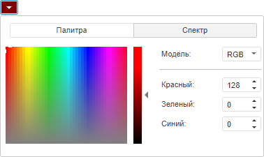

# Color.darker

Color.darker
-

# Color.darker

## Синтаксис

darker(alpha: Number);

## Параметры

alpha. Прозрачность цвета.
 Параметр может принимать значение в интервале от 0 до 1.

## Описание

Метод darker затемняет цвет
 на указанное значение прозрачности.

## Комментарии

Метод уменьшает значение цвета, свойство [прозрачности](Color.A.htm)
 цвета не меняется.

## Пример

Для выполнения примера предполагается наличие на html-странице компонента
 [ColorCombo](dhtmlUi.chm::/components/colorcombo/colorcombo.htm)
 с наименованием «colCombo» (см. «[Пример
 создания компонента ColorCombo](dhtmlUi.chm::/components/colorcombo/example_colorcombo.htm)»). Затемним цвет, выбранный
 в раскрывающемся списке, на 50%.

// Получим цвет, установленный в раскрывающемся списке
var color = colCombo.getColor();
// Выведем в консоль значения параметров цвета
console.log(color);
// Затемним цвет
color = color.darker(0.5);
// Применим изменённый цвет
colCombo.setColor(color);
// Выведем в консоль значения параметров цвета
console.log(color);

В результате выполнения примера цвет, выбранный в раскрывающемся списке,
 будет затемнен на 50%:

В консоль будут выведены значения параметров цвета до затемнения и после.

См. также:

[Color](Color.htm)

		Справочная
		 система на версию 10.9
		 от 18/08/2025,
		 © ООО «ФОРСАЙТ»,
