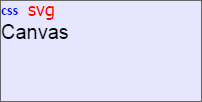

# Font.toCSSFormat

Font.toCSSFormat
-

# Font.toCSSFormat

## Синтаксис

toCSSFormat()

## Описание

Метод toCSSFormat возвращает
 строку в css-формате с настройками шрифта.

## Пример

Для выполнения примера необходимо наличие на html-странице ссылок на
 файлы сценария PP.js и файл стилей PP.css. Создадим div-элемент, выполним
 заливку и разместим в нём строки «css», «svg», «canvas», используя для
 каждой строки разные шрифты:

// Создаём div-элемент
var divElem = PP.createElement(document.body);
// Настраиваем стили для данного элемента
divElem.style.cssText = "width: 200px; height: 100px; border: 1px solid rgb(102, 102, 102);";
// Определяем белый цвет заливки
var backColor1 = new PP.SolidColorBrush({
    Color: "#ffffff"
});
// Определяем синий цвет заливки
var backColor2 = new PP.SolidColorBrush({
    Color: "#0000ff"
});
// Смешиваем цвета
var mixColor = backColor1.getMixColor(backColor2, 0.1);
// Устанавливаем заливку для div-элемента
divElem.style.backgroundColor = mixColor;
// Создаём span-элемент с текстом «css»
var spanElem = PP.createElement(divElem, "", "span");
spanElem.appendChild(document.createTextNode("css"));
var spanFont = new PP.Font({
    Color: "#0000ff", // Синий цвет
    Size: 14,
    IsBold: true // Полужирное начертание
});
// Устанавливаем настройки шрифта для span-элемента
spanElem.style.cssText = spanFont.toCSSFormat();
// Создадим SVG-элемент с текстом «svg»
var svgElem = document.createElementNS("http://www.w3.org/2000/svg", "svg");
svgElem.setAttribute("width", "50");
svgElem.setAttribute("height", "30");
var textElem = document.createElementNS("http://www.w3.org/2000/svg", "text");
textElem.setAttribute("x", "10");
textElem.setAttribute("y", "15");
textElem.appendChild(document.createTextNode("svg"));
svgElem.appendChild(textElem);
divElem.appendChild(svgElem);
var svgFont = new PP.Font({
    FontFamily: "Tahoma", // Семейство шрифтов
        Size: 18,
    Color: "#ff0000"
});
// Устанавливаем настройки шрифта для svg-элемента
svgFont.toSVGFormat(svgElem);
// Создаём canvas-элемент с текстом «canvas»
var canvasElem = PP.createElement(divElem, "", "canvas");
var ctx = canvasElem.getContext("2d");
var canvasFont = new PP.Font({
    FontFamily: "Arial",
        Size: 20,
});
// Устанавливаем настройки шрифта для canvas-элемента
ctx.font = canvasFont.toCanvasFormat();
ctx.fillText("Canvas", 0, 20);
В результате выполнения примера был создан div-элемент, цвет заливки
 которого был получен путём смешивания белого и синего цветов. В данном
 элементе были размещены строки «css», «svg», «canvas», каждая из которых
 имеет свой шрифт:

[Font](Font.htm)

		Справочная
		 система на версию 10.9
		 от 18/08/2025,
		 © ООО «ФОРСАЙТ»,
