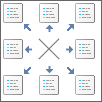
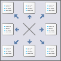
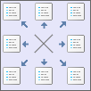
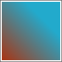

# ImageBrush.Source

ImageBrush.Source
-

# ImageBrush.Source

## Синтаксис

Source: String

## Описание

Свойство Source определяет
 источник данных кисти.

## Комментарии

Значение свойства устанавливается из JSON и с помощью метода setSource,
 а возвращается с помощью метода getSource.

## Пример

Для выполнения примера необходимо наличие на html-странице ссылок на
 файл сценария PP.js и файл стилей PP.css. Также необходимо наличие в папке
 с файлом примера картинки с именем «layout.png». Создадим
 div-элемент и разместим в нём дочерний svg-элемент, для которого установим
 кисть с картинкой. В консоль браузера выведем параметры созданной кисти
 в CSS-формате:

// Создаём div-элемент
var divElem = PP.createElement(document.body);
// Настраиваем стили для данного элемента
divElem.style.cssText = "width: 100px; height: 100px; border: 1px solid rgb(102,102,102);";
// Создаем SVG-элемент с прямоугольником
var svgElem = document.createElementNS("http://www.w3.org/2000/svg", "svg");
svgElem.setAttribute("width", "100");
svgElem.setAttribute("height", "100");
var rectElem = document.createElementNS("http://www.w3.org/2000/svg", "rect");
rectElem.setAttribute("x", "2");
rectElem.setAttribute("y", "2");
rectElem.setAttribute("width", "96");
rectElem.setAttribute("height", "96");
svgElem.appendChild(rectElem);
divElem.appendChild(svgElem);
// Создаем кисть с картинкой
var brush = new PP.ImageBrush();
// Устанавливаем источник данных кисти
var brushSource = "layout.png";
brush.setSource(brushSource);
// Применяем параметры кисти к SVG-элементу
brush.toSVGFormat(rectElem);
// Выводим настройки кисти в CSS-формате
console.log("Настройки кисти в CSS-формате: " + brush.toCSSFormat());
В результате выполнения примера в документе был создан div-элемент,
 в котором был размещен SVG-элемент, для которого была установлена кисть
 с картинкой:

Также в консоль браузера были выведены параметры кисти в CSS-формате:

Настройки кисти в CSS-формате: background:url(layout.png);

Создадим кисти и применим их смешанный цвет к DOM-элементу, в консоль
 выведем код смешанного цвета:

// Создаем кисти и устанавливаем цвета
var brush1 = new PP.SolidColorBrush();
brush1.setColor("#e6e6fa");
var brush2 = new PP.SolidColorBrush();
brush2.setColor("#d5d5d5");
// Применяем смешанный цвет к DOM-узлу
brush1.applyMixToNode(divElem, brush2, 0.5);
// Выводим код смешанного цвета
var mixBrush = brush1.getMix(brush2, 0.5);
console.log("Код смешанного цвета: " + mixBrush.getColor());
В результате для DOM-элемента был установлен смешанный цвет:

Также в консоль браузера был выведен код смешанного цвета:

Код смешанного цвета: #DEDEE8

Применим параметры кисти к DOM-элементу:

// Применяем кисть к DOM-элементу
brush1.applyToNode(divElem);
В результате был изменен фоновый цвет DOM-элемента:

Применим параметры кисти к SVG-элементу:

// Применяем параметры кисти к SVG-элементу
brush1.toSVGFormat(rectElem);
В результате параметры кисти будут применены к SVG-элементу:

Создадим кисть с градиентной линейной заливкой и применим к SVG-элементу:

// Создадим градиентную линейную кисть
gBrush1 = new PP.LinearGradientBrush({
    StartPoint: "0, 1",
    EndPoint: "1, 0",
    GradientStops:
    {
        "GradientStop":
        [
          { "Offset": "0", "Color": "#aa3311" },
          { "Offset": "0.7", "Color": "#22aacc" }
        ]
    }
});
// Применяем параметры кисти к SVG-элементу
gBrush1.toSVGFormat(rectElem);
В результате параметры градиентной кисти будут применены к SVG-элементу:

См. также:

[ImageBrush](ImageBrush.htm)

		Справочная
		 система на версию 10.9
		 от 18/08/2025,
		 © ООО «ФОРСАЙТ»,
