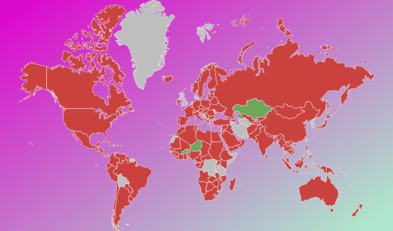

# Конструктор LinearGradientBrush

Конструктор LinearGradientBrush
-

# Конструктор LinearGradientBrush

## Синтаксис

PP.LinearGradientBrush(settings)

## Параметры

settings. JSON-объект со значениями
 свойств экземпляра класса.

## Описание

Конструктор LinearGradientBrush
 создает экземпляр класса [LinearGradientBrush](LinearGradientBrush.htm).

## Пример

Для выполнения примера предполагается наличие на странице компонента
 [MapChart](dhtmlMapChart.chm::/components/mapchart/mapchart.htm)
 с наименованием «map» (см. «[Размещение
 карты на HTML странице](dhtmlMapChart.chm::/components/mapchart/html_layout.htm)»). Установим в качестве фона карты градиентную
 заливку:

        map.setBackground(new PP.LinearGradientBrush({
           EndPoint : "1, 1",
           StartPoint : "0, 0",
           GradientStops:
            {
              "GradientStop":
               [
                  {"Offset" : "0","Color" : "#ffdd00cc"},
                  {"Offset" : "1","Color" : "#ffaaffcc"}
               ]
            }
       }))

После выполнения примера для карты будет установлен следующий фон:

См. также:

[LinearGradientBrush](LinearGradientBrush.htm)

		Справочная
		 система на версию 10.9
		 от 18/08/2025,
		 © ООО «ФОРСАЙТ»,
