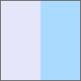

# LinearGradientBrush.applyToNode

LinearGradientBrush.applyToNode
-

# LinearGradientBrush.applyToNode

## Синтаксис

applyToNode(node: HTMLElement);

## Параметры

node. DOM-элемент, к которому
 применяется кисть.

## Описание

Метод applyToNode применяет
 кисть с линейной градиентной заливкой к указанному DOM-элементу.

## Пример

Для выполнения примера необходимо наличие на html-странице ссылок на
 файл сценария PP.js и файл стилей PP.css. Создадим
 div-элемент применим для него линейную градиентную заливку. В консоль
 браузера выведем параметры точки перехода градиента в CSS-формате:

// Создаём div-элемент
var divElem = PP.createElement(document.body);
// Настраиваем стили для данного элемента
divElem.style.cssText = "width: 100px; height: 100px; border: 1px solid rgb(102,102, 102);";
// Создаем линейную градиентную заливку
var gradientSettings = {
    GradientType: 0
}
var gradientBrush = new PP.LinearGradientBrush(gradientSettings);
// Устанавливаем точки перехода градиента
var stop1 = new PP.GradientStop({
    Color: "#e6e6fa",
    Offset: 0.5
});
var stop2 = new PP.GradientStop({
    Color: "#abdaff"
});
gradientBrush.setGradientStops([stop1, stop2]);
// Устанавливаем начальную и конечную относительные точки градиента
var startPoint = new PP.Point({
    X: 0,
    Y: 0
});
var endPoint = new PP.Point({
    X: 0,
    Y: 0
});
gradientBrush.setStartPoint(startPoint);
gradientBrush.setEndPoint(endPoint);
// Применяем кисть
gradientBrush.applyToNode(divElem);
// Выводим параметры точки перехода градиента в CSS-формате
console.log("Параметры точки перехода градиента в CSS-формате: " + stop1.toCSSFormat());
В результате для div-элемента была установлена кисть с линейной градиентной
 заливкой:

Также в консоли браузера были выведены параметры точки перехода градиента
 в CSS-формате:

Параметры точки перехода градиента в CSS-формате:
 rgba(230, 230, 250, 1) 50%

См. также:

[LinearGradientBrush](LinearGradientBrush.htm)

		Справочная
		 система на версию 10.9
		 от 18/08/2025,
		 © ООО «ФОРСАЙТ»,
