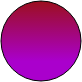
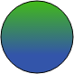
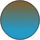

# LinearGradientBrush.getMix

LinearGradientBrush.getMix
-

# LinearGradientBrush.getMix

## Синтаксис

getMix(brush2: [PP.LinearGradientBrush](LinearGradientBrush.htm),
 part: Number, point1 : PP.Point, point2 : PP.Point)

## Параметры

brush2. Кисть с линейной градиентной
 заливкой, с которой требуется выполнить смешивание;

part. Доля использования указываемой
 кисти. Значение может варьироваться от 0 (кисть не применяется) до 1 (применяется
 только данная кисть).

point1. Начальная точка результирующей
 кисти.

point2. Конечная точка результирующей
 кисти.

## Описание

Метод getMix возвращает кисть
 с линейной градиентной заливкой, полученной в результате смешивания
 с указанной кистью в заданном соотношении.

## Комментарии

[GradientStops](../GradientBrush/GradientBrush.GradientStops.htm)
 должны отличаться только цветами.

Метод возвращает значение типа [PP.LinearGradientBrush](LinearGradientBrush.htm).

## Пример

Для выполнения примера необходимо наличие на html-странице ссылок на
 файл сценария PP.js и файл стилей PP.css. Создадим новую кисть и выведем
 значение ее цветов в консоль:

// Создаём div-элемент
var divElem = PP.createElement(document.body);
// Настраиваем стили для данного элемента
divElem.style.cssText = "border-radius: 50%; width: 100px; height: 100px; border: 1px solid rgb(102,102,102);";
// Создадим первый градиент
gBrush1 = new PP.LinearGradientBrush({
    StartPoint : "0, 1",
    EndPoint : "1, 0",
        GradientStops:
        {
          "GradientStop":
          [
            {"Offset" : "0","Color" : "#aa3311"},
            {"Offset" : "0.7","Color" : "#22aacc"}
          ]
        }
});
// Создадим второй градиент
gBrush2 = new PP.LinearGradientBrush({
    StartPoint : "1, 0",
    EndPoint : "0, 1",
        GradientStops:
        {
          "GradientStop":
          [
            {"Offset" : "0","Color" : "#44cc00"},
            {"Offset" : "0.7","Color" : "#3355aa"}
          ]
        }
});
// Создадим точки начала и конца нового градиента
sPoint = new PP.Point({
    X: 0,
    Y: 0
});
ePoint = new PP.Point({
    X: 1,
    Y: 1
});
// Смешаем обе кисти и получим новую
gBrush3 = gBrush1.getMix(gBrush2, 0.2, sPoint, ePoint);
// Выведем в консоль цвета нового градиента
clr1 = gBrush1.getMixColor(gBrush2, 0.2, 0);
clr2 = gBrush1.getMixColor(gBrush2, 0.2, 1);
console.debug(clr1 + " -> " + clr2);
// Применяем смешивание кистей к DOM-элементу отдельным методом
gBrush1.applyMixToNode(divElem, gBrush2, 0.2);
В результате была создана новая кисть для градиентной линейной заливки,
 а значение цветов было выведено в консоль:

#96520e -> #2599c5

При [применении на канву](LinearGradientBrush.applyToCanvas.htm),
 первые две кисти при смешивании дадут третью:

             

При помощи метода applyMixToNode()
 был произведен альтернативный метод применения линейного градиента к DOM-элементу.

См. также:

[LinearGradientBrush](LinearGradientBrush.htm)

		Справочная
		 система на версию 10.9
		 от 18/08/2025,
		 © ООО «ФОРСАЙТ»,
