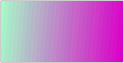

# LinearGradientBrush.toCSSFormat

LinearGradientBrush.toCSSFormat
-

# LinearGradientBrush.toCSSFormat

## Синтаксис

toCSSFormat(withPropName: Boolean, externalStops:
 Object);

## Параметры

withPropName. Признак того,
 будет ли в строку добавлено наименование свойства, для которого требуется
 применить настройки кисти с линейной градиентной заливкой. Необязательный
 параметр. По умолчанию используется значение true;

externalStops. Массив точек
 перехода в градиенте. Необязательный параметр. По умолчанию используется
 массив точек перехода объекта, у которого был вызван метод.

## Описание

Метод toCSSFormat возвращает
 строку в формате css с настройками кисти с линейной градиентной заливкой.

## Пример

Для выполнения примера необходимо наличие на html-странице
 ссылок на файлы сценария jquery.js, PP.js и файл стилей PP.css. Создадим div-элемент и
 установим для него градиентную заливку фона:

// Создаём div-элемент
var divElem = PP.createElement(document.body);
// Настраиваем стили для данного элемента
divElem.style.cssText = "width: 200px; height: 100px; border: 1px solid rgb(102, 102, 102);";
// Создаём кисть с линейной градиентной заливкой
var gradient = new PP.LinearGradientBrush({
    EndPoint: "1, 1",
    Angle: 175,
    StartPoint: "0, 0",
    GradientStops: {
        "GradientStop": [{
            "Offset": "0",
            "Color": "#ffdd00cc"
        }, {
            "Offset": "1",
            "Color": "#ffaaffcc"
        }]
    }
});
// Устанавливаем заливку фона для div-элемента
divElem.style.cssText += gradient.toCSSFormat();
В результате выполнения примера в документе был создан div-элемент,
 для которого была применена линейная градиентная заливка:

См. также:

[LinearGradientBrush](LinearGradientBrush.htm)

		Справочная
		 система на версию 10.9
		 от 18/08/2025,
		 © ООО «ФОРСАЙТ»,
