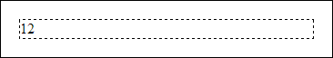

# PP.addClass

PP.addClass
-

**

# PP.addClass

## Синтаксис

addClass(element:HTMLElement, value: String);

## Параметры

*element.* DOM-элемент, к которому
 необходимо добавить CSS-класс;

*value.* Наименование
 CSS-класса.

## Описание

Метод addClass** добавляет
 CSS-класс к указанному элементу DOM-дерева.

## Пример

Для выполнения примера необходимо наличие на html-странице ссылок на
 файлы сценариев PP.js и jquery.js. Создадим DOM-вершину на основе указанной
 строки с html-разметкой, укажем для блока 
 CSS-класс «programText»
 и добавим вершину в документ. Затем зададим для блока внешние отступы,
 настройки границы и определим координаты DOM-вершины:

// Определим строку с разметкой
var markup = "
12
";
// Преобразуем разметку в DOM-вершину
var dom = PP.htmlToDOM(markup, false);
// Добавим класс к блоку
PP.addClass(dom, "programText");
// Добавим DOM-вершину в документ
document.body.appendChild(dom);
if (PP.hasClass(dom, "programText")) {
    // Зададим стили для данного класса
    $("div.programText").css("margin", "20px");
    $("div.programText").css("border", "1px dashed");
    // Определим стиль границы документа
    $("body").css("border", "1px solid");
    // Определим координаты положения DOM-вершины
    var position = PP.calculateOffset(dom);
    console.log("Координаты DOM-вершины: (" + position.X + ", " + position.Y + ")");
} else {
    console.log("CSS-класс «programText» не найден.");
};

В результате выполнения примера на основе html-разметки была создана
 и добавлена в документ DOM-вершина. Для блока 
, являющегося
 корнем созданного дерева, был определён CSS-класс «programText», заданы
 внешние отступы, равные 20 пикселям, и определена пунктирная граница размером
 в 1 пиксель:

В консоли браузера были выведены координаты созданной DOM-вершины:

Координаты DOM-вершины: (28, 20)

См. также:

[PP](../PP.htm)

		Справочная
		 система на версию 10.9
		 от 18/08/2025,
		 © ООО «ФОРСАЙТ»,
