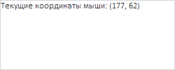

# PP.calculateMouseX

PP.calculateMouseX
-

**

# PP.calculateMouseX

## Синтаксис

calculateMouseX(event);

## Параметры

*event.* Событие мыши.

## Описание

Метод calculateMouseX** вычисляет абсциссу текущего положения курсора мыши.

## Комментарии

Метод возвращает значение типа Number.

## Пример

Для выполнения примера необходимо наличие на html-странице ссылок на файл сценария PP.js и файл стилей PP.css. Создадим текстовую область и обработаем событие щелчка по данной области, выводя в ней текущие координаты курсора мыши:

// Создадим текстовую область
var textArea = new PP.Ui.TextArea({
    ParentNode: document.body,
    Width: 250,
    Height: 100,
});
// Обработаем событие Click
textArea.Click.add(function (sender, args) {
    // Определим текущие координаты мыши
    var coordX = PP.calculateMouseX(args.Event);
    var coordY = PP.calculateMouseY(args.Event);
    textArea.setContent("Текущие координаты мыши: (" + coordX + ", " + coordY + ")");
});

В результате выполнения примера была создана и размещена на странице текстовая область. При щелчке по данной области в ней были выведены текущие координаты мыши:

См. также:

[PP](../PP.htm)

		Справочная
		 система на версию 10.9
		 от 18/08/2025,
		 © ООО «ФОРСАЙТ»,
