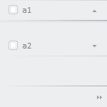

# PP.callEach

PP.callEach
-

# PP.callEach

## Синтаксис

callEach(collection: Array, methodName: String, params: Object|Number|String|Boolean);

## Параметры

*collection.* Коллекция объектов;

*methodName.* Наименование вызываемой функции;

*params.* Параметр функции.

## Описание

Метод callEach выполняет указанную функцию для каждого объекта из коллекции.

## Пример

Для выполнения примера необходимо наличие на html-странице навигационной панели с двумя вкладками (см. пример на странице «[Конструктор AnimationSettings](AnimationSettings/Constructor_AnimationSettings.htm)»). Изменим высоту всех вкладок данной панели:

// Получим коллекцию вкладок
var items = bar.getItems();
// Установим новую высоту для вкладок навигационной панели
PP.callEach(items, "setStyle", "height: 50px;");

В результате выполнения примера для всех вкладок навигационной панели была установлена высота, равная 50 пикселям:

См. также:

[PP](../PP.htm)

		Справочная
		 система на версию 10.9
		 от 18/08/2025,
		 © ООО «ФОРСАЙТ»,
