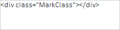

# PP.create

PP.create
-

**

# PP.create

## Синтаксис

create(settings: Object);

## Параметры

*settings.* Настройки создаваемого объекта. Параметр должен содержать свойство PPType, определяющее тип данного объекта.

## Описание

Метод create** создаёт PP-объект по заданным настройкам.

## Комментарии

Метод возвращает PP-объект.

## Пример

Для выполнения примера необходимо наличие на html-странице ссылок на файл сценария PP.js и файл стилей PP.css. Создадим текстовую область и отобразим в ней разметку DOM-элемента, представляющего собой блок «div»:

// Создадим текстовую область
var textArea = PP.create({
    PPType: PP.Ui.TextArea,
    ParentNode: document.body,
    Width: 200,
    Height: 50
});
// Создадим DOM-элемент, представляющий собой блок "div"
var mark = PP.createElement(document.body, 'MarkClass', 'div');
// Отобразим в текстовой области разметку данного DOM-элемента
textArea.setContent(PP.escapeHTML(mark.outerHTML));
/* Проверим, является ли созданный объект экземпляром класса,
проинициализированным с помощью метода PP.initClass */
var isInitClass = PP.isPPInstance(textArea);
console.log("Объект «textArea» " + (isInitClass ? "" : "не ") +
    "является проинициализированным экземпляром класса");

В результате выполнения примера была создана текстовая область, в которой размещена разметка DOM-элемента, представляющего собой блок «div»:

Также было проверено, является ли созданный объект текстовой области экземпляром класса, проинициализированного с помощью метода [PP.initClass](PP.initClass.htm). Результат проверки был выведен в консоль браузера:

Объект «textArea» является проинициализированным экземпляром класса

См. также:

[PP](../PP.htm)

		Справочная
		 система на версию 10.9
		 от 18/08/2025,
		 © ООО «ФОРСАЙТ»,
