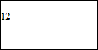

# PP.hide

PP.hide
-

**

# PP.hide

## Синтаксис

hide(element: HTMLElement);

## Параметры

*element.* DOM-элемент, который требуется скрыть.

## Описание

Метод hide** cкрывает указанный DOM-элемент.

## Комментарии

Для корректного выполнения метода необходимо, чтобы указанный элемент был частью DOM-дерева всего документа.

Метод скрывает элемент путём установки для него CSS-класса PPHide.

## Пример

Для выполнения примера необходимо наличие на html-странице ссылок на файл сценария PP.js и на файл стилей PP.cs. Создадим на основе разметки DOM-элемент, добавим его в документ, скроем, а затем вновь отобразим:

// Определим строку с разметкой
var markup = "

12

";
// Преобразуем разметку в DOM-вершину
var dom = PP.htmlToDOM(markup, false);
// Добавим DOM-вершину в документ
document.body.appendChild(dom);
console.log("Исходное наименование класса: " + (dom.className.length == 0 ? "\"\"" : dom.className));
// Скроем элемент
if (PP.isVisible(dom)) {
    PP.hide(dom);
};
console.log("Класс после скрытия элемента: " + (dom.className.length == 0 ? "\"\"" : dom.className));
// Отобразим элемент
if (!PP.isVisible(dom)) {
    PP.show(dom);
};
console.log("Класс после отображения элемента: " + (dom.className.length == 0 ? "\"\"" : dom.className));

В результате выполнения примера на основе html-разметки была создана и добавлена в документ DOM-вершина:

О том, что элемент был скрыт, а потом вновь отображён, свидетельствует информация, выведенная в консоли браузера:

Исходное наименование класса: ""

Класс после скрытия элемента: PPHide

Класс после отображения элемента: ""

См. также:

[PP](../PP.htm)

		Справочная
		 система на версию 10.9
		 от 18/08/2025,
		 © ООО «ФОРСАЙТ»,
