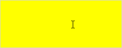

# PP.reallyOut

PP.reallyOut
-

**

# PP.reallyOut

## Синтаксис

reallyOut(element: HTMLDocument, event);

## Параметры

*element.* DOM-элемент;

*event.* Событие курсора мыши.

## Описание

Метод reallyOut** определяет, действительно ли курсор мыши покинул указанный элемент или ушел с одного дочернего элемента на другой.

## Комментарии

Метод возвращает значение true, если курсор мыши покинул указанный элемент или ушел с одного дочернего элемента на другой, иначе - значение false.

## Пример

Для выполнения примера необходимо наличие на html-странице ссылок на файл сценария PP.js и файл стилей PP.css. Создадим текстовую область и будем окрашивать её в жёлтый цвет, если курсор мыши находится внутри данной области, и в красный цвет, если он покинул её:

// Создадим текстовую область
var textArea = new PP.Ui.TextArea({
    ParentNode: document.body,
    Width: 250,
    Height: 100,
    Style: "background-color: #ff0000;"
});
// Обработаем событие MouseOver
textArea.MouseOver.add(function (sender, args) {
    // Получим DOM-элемент текстовой области
    var dom = sender.getDomNode();
    if (PP.reallyOver(dom, PP.fixEvent(args.Event, dom))) {
        /* Перекрашиваем текстовую область в жёлтый цвет,
		если курсор мыши находится над текстовой областью */
        textArea.setStyle("background-color: #ffff00;")
        //Чтобы текстовая область не растягивалась по ширине на весь экран
        dom.style.width = "250px";
    };
});
// Обработаем событие MouseOut
textArea.MouseOut.add(function (sender, args) {
    // Получим DOM-элемент текстовой области
    var dom = sender.getDomNode();

    if (PP.reallyOut(dom, PP.fixEvent(args.Event, dom))) {
        /* Перекрашиваем текстовую область в красный цвет,
		если курсор мыши покинул текстовую область */
        textArea.setStyle("background-color: #ff0000;")
        //Чтобы текстовая область не растягивалась по ширине на весь экран
        dom.style.width = "250px";
    };
});

В результате выполнения примера текстовая область будет окрашиваться в жёлтый цвет, если курсор мыши находится внутри неё:

Если курсор мыши покинул текстовую область, то данная область окрасится в красный цвет:

См. также:

[PP](../PP.htm)

		Справочная
		 система на версию 10.9
		 от 18/08/2025,
		 © ООО «ФОРСАЙТ»,
