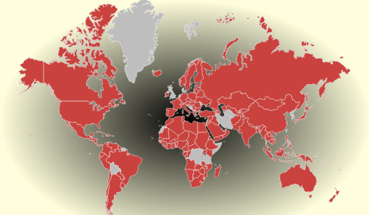

# Конструктор RadialGradientBrush

Конструктор RadialGradientBrush
-

# Конструктор RadialGradientBrush

## Синтаксис

PP.RadialGradientBrush(settings)

## Параметры

settings. JSON-объект
 со значениями свойств экземпляра класса.

## Описание

Конструктор RadialGradientBrush
 создает экземпляр класса [RadialGradientBrush](RadialGradientBrush.htm).

## Пример

Для выполнения примера предполагается наличие на странице компонента
 [MapChart](dhtmlMapChart.chm::/components/mapchart/mapchart.htm)
 с наименованием «map» (см. «[Размещение
 карты на HTML странице](dhtmlMapChart.chm::/components/mapchart/html_layout.htm)»). Установим в качестве фона карты радиальную
 заливку:

       map.setBackground(new PP.RadialGradientBrush({
               Center: new PP.Point(0.5, 0.5),
               GradientStops: {
                 GradientStop:
                  [
                     { Offset: 0, Color: "#ff000000" },
                     { Offset: 1, Color: "#ffffffdd" }
                  ]
           }
       }))

После выполнения примера для карты будет установлен следующий фон:

См. также:

[RadialGradientBrush](RadialGradientBrush.htm)

		Справочная
		 система на версию 10.9
		 от 18/08/2025,
		 © ООО «ФОРСАЙТ»,
