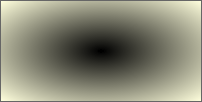

# RadialGradientBrush.toCSSFormat

RadialGradientBrush.toCSSFormat
-

# RadialGradientBrush.toCSSFormat

## Синтаксис

toCSSFormat();

## Описание

Метод toCSSFormat возвращает
 строку в формате css с настройками кисти с радиальной градиентной заливкой.

## Пример

Для выполнения примера необходимо наличие на html-странице
 ссылок на файлы сценария jquery.js, PP.js и файл стилей PP.css. Создадим div-элемент и
 установим для него градиентную заливку фона:

// Создаём div-элемент
var divElem = PP.createElement(document.body);
// Настраиваем стили для данного элемента
divElem.style.cssText = "width: 200px; height: 100px; border: 1px solid rgb(102, 102, 102);";
// Создаём кисть с радиальной градиентной заливкой
var gradient = new PP.RadialGradientBrush({
    Center: new PP.Point(0.5, 0.5),
    GradientStops: {
        GradientStop: [{
            Offset: 0,
            Color: "#ff000000"
        }, {
            Offset: 1,
            Color: "#ffffffdd"
        }]
    }
});
// Устанавливаем заливку фона для div-элемента
divElem.style.cssText += gradient.toCSSFormat();
В результате выполнения примера в документе был создан div-элемент,
 для которого была применена радиальная градиентная заливка:

[RadialGradientBrush](RadialGradientBrush.htm)

		Справочная
		 система на версию 10.9
		 от 18/08/2025,
		 © ООО «ФОРСАЙТ»,
