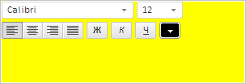

# ScriptManager.loadScript

ScriptManager.loadScript
-

# ScriptManager.loadScript

## Синтаксис

PP.ScriptManager.loadScript(url: String, callback:
 PP.Delegate|function, head: String, id: String);

## Параметры

url. URL-адрес сценария;

callback. Возвратная функция,
 выполняемая после загрузки сценария;

head. Тэг, в котором будет
 подключён сценарий. Необязательный параметр, по умолчанию равен «head»;

id. Идентификатор для тэга
 <script>. Необязательный параметр.

## Описание

Метод loadScript загружает JS-сценарий.

## Пример

Для выполнения примера необходимо создать html-страницу и выполнить
 следующие действия:

1. Подключить js-файл PP.js.

2. В теге <body> разместить элемент 
 с идентификатором «box».

3. В корневой папке необходимо наличие папок css и script. В первой
 из них должен быть размещён файл PP.css и пользовательский файл settings.css
 со следующим содержимым:

#box {
    width: 300px;
    height: 100px;
    background-color: yellow;
}
В папке script должен находиться файл fontBox.js со следующим содержимым:

// Создадим компонент для настройки текста
var fontBox = new PP.Ui.FontBox();
// Получим dom-элемент компонента
var dom = fontBox.getDomNode();
// Разместим компонент в блок div
document.body.getElementsByTagName("div")[0].appendChild(dom);
4. В родительском каталоге должна находиться стандартная папка веб-приложения
 «Форсайт. Аналитическая платформа» с файлами
 изображений img, а также папка с ресурсами resources.

Загрузим программно на html-страницу файлы PP.css, settings.css, fontBox.js,
 resources.ru.js и обработаем события загрузки сценариев [BeforeScriptLoad](ScriptManager.BeforeScriptLoad.htm),
 [ScriptLoaded](ScriptManager.ScriptLoaded.htm), [AllNodesLoaded](ScriptManager.AllNodesLoaded.htm).
 Для этого необходимо открыть созданную html-страницу и выполнить в консоли
 браузера следующий сценарий:

PP.ImagePath = "../img/"; // Зададим путь к файлам изображений
PP.ScriptPath = "script/"; // Зададим путь к js-сценариям
PP.CSSPath = "css/"; // Зададим путь к css-файлам
// Обработаем событие BeforeScriptLoad
PP.ScriptManager.BeforeScriptLoad.add(function (sender, args) {
    console.log("Будет загружен следующий сценарий: " + args.Src);
});
// Обработаем событие ScriptLoaded
PP.ScriptManager.ScriptLoaded.add(function (sender, args) {
    console.log("Загруженный сценарий (с параметрами): " + args.Src);
    console.log("Загруженный сценарий (без параметров): " + PP.ScriptManager.getRawUrl(args.Src));
});
// Обработаем событие AllNodesLoaded
PP.ScriptManager.AllNodesLoaded.add(function (sender, args) {
    console.log("Все сценарии загружены");
});
// Загрузим настройки
PP.ScriptManager.loadScript(PP.ScriptPath + "fontBox.js");
// Загрузим настройки для ресурсов
PP.ScriptManager.loadScripts(["../resources/resources.ru.js"]);
// Укажем путь к корневой папке, содержащей файлы ресурсов
PP.resourceManager.setRootResourcesFolder("../resources/");
var styles = [PP.CSSPath + "settings.css", PP.CSSPath + "PP.css"];
// Загрузим стили
PP.ScriptManager.loadStyles(styles);
В результате выполнения примера для элемента 
 был применен
 пользовательский стиль, а также в нём был размещён компонент для форматирования
 текста:

В консоли браузера были выведены адреса сценариев, которые должны быть
 загружены, уже загружены (с параметрами и без параметров), а также сообщение
 о завершении их загрузки:

Будет загружен следующий сценарий: script/fontBox.js

Будет загружен следующий сценарий: ../resources/resources.ru.js

true

Загруженный сценарий (с параметрами): ../resources/resources.ru.js?pp=8.0.21218.0

Загруженный сценарий (без параметров): ../resources/resources.ru.js

Все сценарии загружены

См. также:

[ScriptManager](ScriptManager.htm)

		Справочная
		 система на версию 10.9
		 от 18/08/2025,
		 © ООО «ФОРСАЙТ»,
