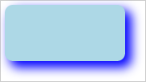

# Конструктор Shadow

Конструктор Shadow
-

# Конструктор Shadow

## Синтаксис

PP.Shadow(settings);

## Параметры

settings. JSON-объект со значениями свойств компонента.

## Описание

Конструктор Shadow создает экземпляр класса [Shadow](Shadow.htm).

## Пример

Для выполнения примера необходимо наличие на html-странице ссылок на файл сценария PP.js и файл стилей PP.css. В теге <body> разместим блок с идентификатором «textArea» для хранения текстовой области:

Далее в теге <body> необходимо добавить сценарий, в котором добавим текстовую область и установим для неё новый стиль, для которого будут описаны параметры тени:

// Создадим текстовую область
var textArea = new PP.Ui.TextArea({
    Width: 150, // Ширина
    Height: 70, // Высота
    ParentNode: document.getElementById("textArea") // Родительский контейнер
});
// Создадим объект тени
var shadow = new PP.Shadow({
    Enabled: true, // Активность тени
    Color: new PP.Color(PP.Color.Colors.blue), // Цвет тени
    Angle: 45, // Угол падения тени
    Size: 1, // Размер тени
    EnableBlur: true, // Признак использования размытия
    EnableOpacity: true, // Признак использования прозрачности
    BlurSize: 20, // Размер размытия тени
    Distance: 10, // Сдвиг тени относительно объекта
});
// Определим стиль
var style = {
    Release: new PP.Style({
        // Определим фон
        Background: new PP.SolidColorBrush({
            Color: PP.Color.Colors.lightblue
        }),
        // Определим границу
        Border: new PP.Border({
            Radius: 10
        }),
        // Установим тень
        Shadow: shadow
    })
};
// Установим стиль для текстовой области
textArea.setStyle(style);

В результате в документе была создана текстовая область, для которой была установлена тень:

См. также:

[Shadow](Shadow.htm)

		Справочная
		 система на версию 10.9
		 от 18/08/2025,
		 © ООО «ФОРСАЙТ»,
