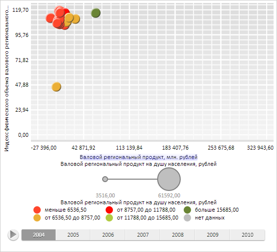

# Shadow.toSVGFormat

Shadow.toSVGFormat
-

**

# Shadow.toSVGFormat

## Синтаксис

toSVGFormat(element: SVGElement);

## Параметры

element. SVG-элемент, для которого
 применяется тень.

## Описание

Метод toSVGFormat** применяет
 тень к SVG-элементу.

## Пример

Для выполнения примера необходимо наличие на html-странице компонента
 [BubbleChart](dhtmlBubbleChart.chm::/Components/BubbleChart/BubbleChart.htm)
 с наименованием «bubbleChart» (см. «[Пример
 создания компонента BubbleChart](dhtmlBubbleChart.chm::/Components/BubbleChart/BubbleChart_Example.htm)»). Создадим объект тени и установим
 его для SVG-элемента текстовой метки оси X области диаграммы:

// Определим тень
var shadow = new PP.Shadow({
    Enabled: true,
    Color: new PP.Color(PP.Color.Colors.blue),
    Angle: 45,
    Size: 1,
    EnableBlur: true,
    EnableOpacity: true,
    BlurSize: 20,
    Distance: 10,
    Opacity: 0.5
});
// Получим текстовую метку оси X
var label = bubbleChart.getChartArea().getAxisX().getCaption();
// Установим тень для SVG элемента полученной метки
shadow.toSVGFormat(label.getDomNode().firstChild);
В результате выполнения примера для полученной текстовой метки была
 установлена тень:

См. также:

[Shadow](Shadow.htm)

		Справочная
		 система на версию 10.9
		 от 18/08/2025,
		 © ООО «ФОРСАЙТ»,
