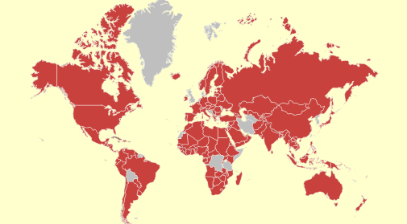

# Конструктор SolidColorBrush

Конструктор SolidColorBrush
-

# Конструктор SolidColorBrush

## Синтаксис

PP.SolidColorBrush(settings)

## Параметры

settings. JSON-объект
 со значениями свойств экземпляра класса.

## Описание

Конструктор SolidColorBrush
 создает экземпляр класса [SolidColorBrush](SolidColorBrush.htm).

## Пример

Для выполнения примера предполагается наличие на странице компонента
 [MapChart](dhtmlMapChart.chm::/components/mapchart/mapchart.htm)
 с наименованием «map» (см. «[Размещение
 карты на HTML странице](dhtmlMapChart.chm::/components/mapchart/html_layout.htm)»). Установим в качестве фона карты сплошную
 заливку:

	map.setBackground(new PP.SolidColorBrush({
	    Color: "Yellow",
                Opacity: 0.2
        }))

После выполнения примера для карты будет установлен следующий фон:

[SolidColorBrush](SolidColorBrush.htm)

		Справочная
		 система на версию 10.9
		 от 18/08/2025,
		 © ООО «ФОРСАЙТ»,
