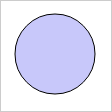

# SolidColorBrush.applyToCanvas

SolidColorBrush.applyToCanvas
-

# SolidColorBrush.applyToCanvas

## Синтаксис

applyToCanvas(ctx: CanvasRenderingContext2D);

## Параметры

ctx. Контекст отрисовки.

## Описание

Метод applyToCanvas применяет
 кисть со сплошной заливкой к указанной канве.

## Пример

Для выполнения примера необходимо наличие на html-странице ссылок на
 файл сценария PP.js и файл стилей PP.css. В теге <body> необходимо
 разместить блок с идентификатором «canvas»:

 Создадим канву и применим к ней кисть с указанным цветом, отрисуем
 круг на созданной канве:

// Создаем канву
var settings = {
    Width: 100,
    Height: 100
}
var canvas = new PP.Ui.Canvas(settings);
canvas.setLeft(18);
canvas.setTop(12);
// Создаем кисть
var brush = new PP.SolidColorBrush();
brush.setColor("#c8c8fa");
// Применяем настройки кисти для канвы
brush.applyToCanvas(canvas.getContext());
// Размещаем канву в блоке 

var container = document.getElementById("canvas");
canvas.addToNode(container)
// Отрисовываем круг на канве
canvas.drawCircle(50, 50, 40, true, true);
canvas.flush();
В результате будет отрисован круг с заливкой указанного цвета:

[SolidColorBrush](SolidColorBrush.htm)

		Справочная
		 система на версию 10.9
		 от 18/08/2025,
		 © ООО «ФОРСАЙТ»,
