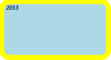

# Конструктор Style

Конструктор Style
-

**

# Конструктор Style

## Синтаксис

PP.Style(settings: Object);

## Параметры

settings. JSON-объект
 со значениями свойств экземпляра класса.

## Описание

Конструктор Style** создаёт экземпляр класса [Style](Style.htm).

## Пример

Для выполнения примера необходимо наличие на html-странице ссылок на
 файлы сценария jquery.js, PP.js и файл стилей PP.css. Добавим в документ
 текстовую область и установим для неё новый стиль:

В результате выполнения примера в документе была создана текстовая область
 с голубым цветом заливки, полужирным и курсивным начертанием шрифта, границей
 с радиусом закругления, равным 10, и тенью жёлтого цвета:

В консоли браузера было выведено представление стиля, установленного
 для текстовой области, в виде строки CSS:

CSS: box-shadow:0px 0px 0px 10px rgba(255, 255,
 0, 1) ;color:#000000;font-size:12px;font-family:Calibri, Helvetica;font-weight:bold;font-style:italic;text-decoration:none;border-style:none;border-width:0px;border-radius:10px;background:#ADD8E6;

См. также:

[Style](Style.htm)

		Справочная
		 система на версию 10.9
		 от 18/08/2025,
		 © ООО «ФОРСАЙТ»,
