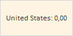

# Конструктор Thickness

Конструктор Thickness
-

# Конструктор Thickness

## Синтаксис

PP.Thickness(settings)

## Параметры

settings. JSON-объект
 со значениями свойств экземпляра класса.

## Описание

Конструктор Thickness создает
 экземпляр класса Thickness.

## Пример

Для выполнения примера предполагается наличие на html-страницы компонента
 [MapChart](dhtmlMapChart.chm::/components/mapchart/mapchart.htm)
 с наименованием «map» (см. «[Размещение
 карты на HTML странице](dhtmlMapChart.chm::/components/mapchart/html_layout.htm)»). Для карты установлена топооснова World.svg
 и файл с настройками MapData_World.xml.

Настроим размер отступов по краям всплывающей подсказки:

map.getShape("US").getToolTip().setMargin(new PP.Thickness({Top:20, Bottom:20,
 Left:5, Right:5}));

Всплывающая подсказка будет иметь следующий вид:

Отступы от левого и правого края - 5 пикселей.

Отступы снизу и сверху - 10 пикселей.

Для настройки всем отступам одинаковых значений, достаточно использовать
 свойство [Width](Thickness.Width.htm).

map.getShape("US").getToolTip().setMargin(new PP.Thickness({Width: 20}));

См. также:

[Thickness](Thickness.htm)

		Справочная
		 система на версию 10.9
		 от 18/08/2025,
		 © ООО «ФОРСАЙТ»,
