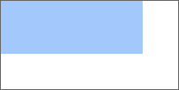
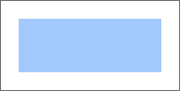

# Thickness.toCSSFormat

Thickness.toCSSFormat
-

# Thickness.toCSSFormat

## Синтаксис

toCSSFormat(propertyName: String);

## Параметры

propertyName. Наименование
 свойства, для которого требуется применить настройки отступов.

## Описание

Метод toCSSFormat возвращает
 строку в формате css с настройками отступов.

## Пример

Для выполнения примера необходимо наличие на html-странице
 ссылок на файлы сценария jquery.js, PP.js и файл стилей PP.css. Создадим div-элемент:

// Создаём div-элемент
var divElem = PP.createElement(document.body);
// Настраиваем стили для данного элемента
divElem.style.cssText = "width: 200px; height: 100px; border: 1px solid rgb(102, 102, 102);";
// Создаем SVG-элемент с прямоугольником
var svgElem = document.createElementNS("http://www.w3.org/2000/svg", "svg");
svgElem.setAttribute("width", "200");
svgElem.setAttribute("height", "100");
var rectElem = document.createElementNS("http://www.w3.org/2000/svg", "rect");
rectElem.setAttribute("x", "0");
rectElem.setAttribute("y", "0");
rectElem.setAttribute("width", "160");
rectElem.setAttribute("height", "60");
rectElem.setAttribute("fill", "#a3c8fc");
svgElem.appendChild(rectElem);
divElem.appendChild(svgElem);
В результате выполнения примера в документе был создан div-элемент,
 в котором был размещен прямоугольник:

Далее устанавливаем новые значения отступов для прямоугольника, размещенного
 в div-элементе:

// Создаем объект со значениями отступов svg-элемента
var margin = new PP.Thickness({
    Left: 20,
    Top: 20
});
// Устанавливаем отступы svg-элемента
svgElem.style.cssText = margin.toCSSFormat("margin");
В результате этого действия для прямоугольника, размещенного в div-элементе,
 были установлены новые значения отступов:

[Thickness](Thickness.htm)

		Справочная
		 система на версию 10.9
		 от 18/08/2025,
		 © ООО «ФОРСАЙТ»,
