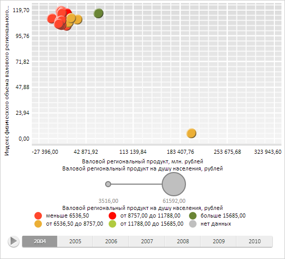

# TimeAxis.add

TimeAxis.add
-

# TimeAxis.add

## Синтаксис

add(item: Number);

## Параметры

item. Добавляемый элемент данных.

## Описание

Метод add добавляет элемент
 в конец массива данных временной оси.

## Пример

Для выполнения примера необходимо наличие на html-странице компонента
 [BubbleChart](dhtmlBubbleChart.chm::/Components/BubbleChart/BubbleChart.htm)
 с наименованием «bubbleChart» (см. «[Пример
 создания компонента BubbleChart](dhtmlBubbleChart.chm::/Components/BubbleChart/BubbleChart_Example.htm)»). Очистим данные временной оси X.
 Определим и установим новые массивы данных для временных осей X и Y. Для
 временной оси X добавим новый элемент в конец массива данных, добавим
 и удалим элементы по указанным индексам. Заменим элемент в позиции с указанным
 индексом временной оси Y. Выведем количество элементов временных осей
 и первое не пустое значение временное оси X:

// Получим источник данных
var dataSource = bubbleChart.getDataSources().ds0;
// Получим временную ось X
var timeAxisX = dataSource.getTimeAxis("Serie0_Point0", "DimX");
// Получим временную ось Y
var timeAxisY = dataSource.getTimeAxis("Serie0_Point0", "DimY");
// Очистим данные временной оси X
timeAxisX.clear();
// Определим и установим массивы данных для временных осей
var axisXItems = new Array(40000, 80000, 120000);
var axisYItems = new Array(10, 15, 20);
// Добавим массив элементов оси X
timeAxisX.addItems(axisXItems);
// Установим массив элементов оси Y
timeAxisY.setItems(axisYItems);
// Добавим элемент в конец массива данных временной оси X
timeAxisX.add(200000);
// Вставим элемент в позицию с индексом 0 временной оси X
timeAxisX.insertAt(0, 200000);
// Удалим элемент из позиции с индексом 3 временной оси X
timeAxisX.removeAt(3);
// Заменим элемент в позиции с индексом 0 временной оси Y
timeAxisY.setItem(0, 5);
// Выведем количество элементов временных осей
console.log("Количество элементов временной оси X: " + timeAxisX.getCount());
console.log("Количество элементов временной оси Y: " + timeAxisY.getCount());
// Обновим диаграмму
bubbleChart.refresh();
// Получим первое не пустое значение временной оси X
console.log("Первое не пустое значение временной оси X: " + timeAxisX.getFirstNotNullData());
В результате выполнения примера были изменены данные временных осей
 X и Y для полученного временного ряда:

Также в консоли браузера было выведено количество элементов временных
 осей и первое не пустое значение временной оси X:

Количество элементов временной оси X: 4

Количество элементов временной оси Y: 3

Первое не пустое значение временной оси X: 200000

См. также:

[TimeAxis](TimeAxis.htm)

		Справочная
		 система на версию 10.9
		 от 18/08/2025,
		 © ООО «ФОРСАЙТ»,
