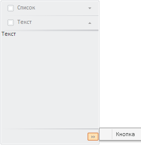
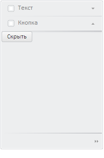

# Пример создания компонента NavigationBar

Пример создания компонента NavigationBar
-

# Пример создания компонента NavigationBar

Для выполнения примера подключите ссылки на библиотеку PP.js и таблицы
 визуальных стилей PP.css. Далее приведен сценарий, при помощи которого
 на html-странице размещается компонент [NavigationBar](NavigationBar.htm),
 состоящий из трех панелей.

// Список - содержимое первой панели
var LB = new PP.Ui.ListBox({
    Items: [{
        Content: "Денежный"
    }, {
        Content: "Финансовый"
    }, {
        Content: "Краткий формат даты"
    }, {
        Content: "Длинный формат даты"
    }]
});
// Кнопка - содержимое третьей панели
var btn = new PP.Ui.Button({
    Content: "Скрыть"
});
// Обработчик события Click: при нажатии на кнопку панель будет сворачиваться
btn.Click.add(function(sender, args) {
    item1.collapse();
});
// Навигатор
var navigationBar = new PP.Ui.NavigationBar({
    // Идентификатор, содержащийся в теге div
    ParentNode: document.getElementById("navigationBar1"),
    // Создаем и добавляем в навигатор первую панель
    Items: [{
        Title: "Список",
        Content: LB
    }],
    Width: 200, // Ширина компонента
    ShowBorders: true,
    IsAlwaysExpanded: false //Все вкладки свернуты
});
// Создаем вторую панель
var item0 = new PP.Ui.NavigationItem({
    Title: "Текст",
    Content: "Текст" // Содержимое панели
});
// Содержимое панели - экземпляр компонента Button
var item1 = new PP.Ui.NavigationItem({
    Title: "Кнопка",
    Content: btn
});
// Добавляем вторую и третью панели:
navigationBar.addItem(item0);
navigationBar.addItem(item1);
После выполнения примера на html-странице в блоке с идентификатором
 «navigationBar1» будет размещен компонент [NavigationBar](NavigationBar.htm),
 имеющий следующий вид:

В данном примере верхняя панель создана и добавлена в навигатор с помощью
 свойства [Items](../../Classes/NavigationBar/NavigationBar.Items.htm)
 в параметрах [конструктора
 NavigationBar](../../Classes/NavigationBar/Constructor_NavigationBar.htm). Остальные панели созданы с помощью [конструктора
 NavigationItem](../../Classes/NavigationItem/Constructor_NavigationItem.htm) и добавлены методом [NavigationBar.addItem](../../Classes/NavigationBar/NavigationBar.addItem.htm).

При нажатии на верхнюю вкладку с заголовком «Список», будет раскрыта
 панель. При этом остальные вкладки спускаются вниз, а нижняя вкладка скрывается.
 Появляется кнопка, при нажатии на которую раскрывается меню, состоящее
 из заголовков скрытых панелей. Выбрав элемент меню, можно вернуться к
 нужной скрытой панели:

Если раскрыта средняя или нижняя панель, то скрывается верхняя вкладка:

Содержимым панелей могут быть произвольные объекты, которые задаются
 в свойстве [Content](dhtmlUi.chm::/Classes/Control/Control.Content.htm).
 В данном примере содержимое верхней панели - экземпляр класса [ListBox](dhtmlList.chm::/Classes/ListBox/ListBox.htm),
 содержимое средней панели - строка «Текст», содержимое нижней панели -
 экземпляр класса [Button](dhtmlUi.chm::/Classes/Button/Button.htm)
 - кнопка, при нажатии на которую сворачивается панель.

На вкладках расположены заголовки панелей, которые задаются свойством
 [NavigationItem.Title](../../Classes/NavigationItem/NavigationItem.Title.htm),
 элементы управления (по умолчанию - экземпляры класса [CheckBox](dhtmlUi.chm::/Classes/CheckBox/CheckBox.htm))
 и стрелки, направленные вниз, если панель закрыта, и вверх, если панель
 открыта.

Примечание.
 Элементы управления на вкладке не отображаются, если для свойства [NavigationItem.IsHeaderControlVisible](../../Classes/NavigationItem/NavigationItem.IsHeaderControlVisible.htm)
 установлено значение false. Кроме
 того, можно установить свои элементы управления, например, компоненты
 [RadioButton](dhtmlUi.chm::/Classes/RadioButton/RadioButton.htm),
 [Button](dhtmlUi.chm::/Classes/Button/Button.htm), [ComboBox](dhtmlUi.chm::/Classes/ComboBox/ComboBox.htm),
 с помощью свойства [NavigationItem.HeaderControl](../../Classes/NavigationItem/NavigationItem.HeaderControl.htm).

См. также:

[NavigationBar](NavigationBar.htm)

		Справочная
		 система на версию 10.9
		 от 18/08/2025,
		 © ООО «ФОРСАЙТ»,
