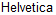
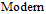
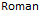
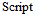

# Font.Family

Font.Family
-

# Font.Family

Пространство имен: PP;

## Описание

Перечисление Font.Family содержит
 наименования шрифта.

Используется следующими свойствами и методами:

	- [Font.FontFamily](../Classes/PP/Font/Font.FontFamily.htm);

	- [TextEditor.FontFamily](dhtmlUi.chm::/Classes/TextEditor/TextEditor.FontFamily.htm).

## Допустимые значения

		 Значение
		 Краткое описание

		 "Arial"
		 Arial

		 "Calibri"
		 Calibri

		 "Comic Sans MS"
		 Comic
		 Sans MS

		 "Courier"
		 Courier

		 "Georgia"
		 Georgia

		 "Helvetica"
		 

		 "Impact"
		 Impact

		 "Modern"
		 

		 "Roman"
		 

		 "Script"
		 

		 "Tahoma"
		 Tahoma

		 "Times New Roman"
		 Times
		 New Roman

		 "Verdana"
		 Verdana

См. также:

[PP](../Classes/PP.htm)

		Справочная
		 система на версию 10.9
		 от 18/08/2025,
		 © ООО «ФОРСАЙТ»,
