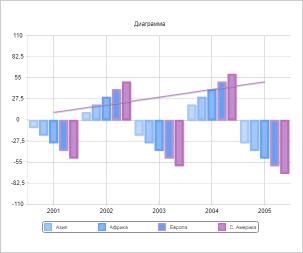

# ZoomOptionsSettings.Zoom

ZoomOptionsSettings.Zoom
-

# ZoomOptionsSettings.Zoom

## Синтаксис

Zoom: number;

## Описание

Свойство Zoom определяет значение
 масштаба.

## Комментарии

Масштаб задаётся в виде десятичной дроби, например:

	- уменьшение масштаба визуального компонента в два раза - 0.5;

	- увеличение масштаба визуального компонента в два раза - 2.

По умолчанию задан 100% масштаб, свойство принимает значение «1».

Для применения заданного масштаба используются средства CSS. Выберите
 один из способов:

	- задайте значение масштаба в поле zoom, например - zoom: 0.5;

Примечание.
 Поле zoom не поддерживается в браузере Mozilla Firefox.

	- задайте значение масштаба в поле transform, например - transform:
	 scale(0.5).

Значение масштаба, заданное в поле zoom или transform, должно совпадать
 со значением свойства.

Значение свойства задается в конструкторе [ZoomOptions](../../Classes/PP/ZoomOptions/Constructor_ZoomOptions.htm)
 или с помощью метода setZoom,
 а возвращается с помощью метода getZoom.

В зависимости от выбранного способа применения заданного масштаба (zoom
 или transform) задайте значения методам [ZoomOptions.setIsOnlyPosition](ZoomOptionsSettings.IsOnlyPosition.htm),
 [ZoomOptions.setIsCssZoom](ZoomOptionsSettings.IsCssZoom.htm)
 или свойствам [IsOnlyPosition](ZoomOptionsSettings.IsOnlyPosition.htm),
 [IsCssZoom](ZoomOptionsSettings.IsCssZoom.htm) в конструкторе
 [ZoomOptions](../../Classes/PP/ZoomOptions/Constructor_ZoomOptions.htm).

## Пример

Для выполнения примера необходимо наличие на html-странице компонента
 [Chart](dhtmlChart.chm::/Components/Chart/Chart.htm)
 с наименованием «chart» (см. «[Пример
 создания гистограммы](dhtmlChart.chm::/Components/Chart/Chart_Example.htm)»). В теге 

Уменьшим масштаб гистограммы в два раза:

// Получим параметры масштабирования гистограммы
var zoom = chart.getZoom();
// Зададим значение масштаба
zoom.setZoom(0.5);
// Определим способ применения заданного масштаба через поле zoom
zoom.setIsOnlyPosition(true);
zoom.setIsCssZoom(true);

В результате выполнения примера гистограмма будет уменьшена в два раза:

См. также:

[ZoomOptionsSettings](ZoomOptionsSettings.htm)

		Справочная
		 система на версию 10.9
		 от 18/08/2025,
		 © ООО «ФОРСАЙТ»,
