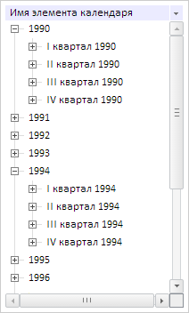

# DimSrv.beginBatch

DimSrv.beginBatch
-

# DimSrv.beginBatch

## Синтаксис

beginBatch(bIgnoreError: Boolean);

## Параметры

bIgnoreError. Признак независимой
 обработки запросов в пакете. Допустимые значения:

	- true.
	 Запросы в пакете будут обрабатываться независимо;

	- false.
	 Запросы в пакете не будут обрабатываться независимо.

## Описание

Метод beginBatch включает пакетный
 режим отправки запросов.

## Комментарии

Отключение пакетного режима отправки запросов производится с помощью
 метода [DimSrv.endBatch](DimSrv.endBatch.htm).

## Пример

Для выполнения примера предполагается наличие на html-странице компонента
 [DimTree](../../../Components/Metabase/DimTree/DimTree.htm)
 с наименованием «dimTree», источником которого является справочник «dim»
 (см. «[Пример
 создания компонента DimTree](../../../Components/Metabase/DimTree/DimTree_Example.htm)»). Создадим сервис для работы со справочниками,
 проверим, включен ли пакетный режим отправки запросов, и, если не включен,
 то включаем его:

// Создаем сервис для работы со справочниками
var dimService = new PP.Mb.DimSrv({
    Metabase: mb
});
// Проверяем, включен ли пакетный режим отправки запросов
if (dimService.getIsBatchMode()) {
    console.log("Пакетный режим отправки запросов включен");
} else {
    console.log("Пакетный режим отправки запросов не включен");
    dimService.beginBatch();
}
В консоль будет выведено сообщение о проверке включения пакетного режима
 отправки запросов:

Пакетный режим отправки запросов не включен

Откроем элементы с содержимым «1990» и «1994». Элементы
 раскроются, но будут пустыми:

Отключим пакетный режим отправки запросов:

// Отключаем пакетный режим отправки запросов
dimService.endBatch(false);
После отключения пакетного режима отправки запросов будет отправлен
 запрос на сервер и содержимое раскрытых элементов будет загружено:

См. также:

[DimSrv](DimSrv.htm)

		Справочная
		 система на версию 10.9
		 от 18/08/2025,
		 © ООО «ФОРСАЙТ»,
