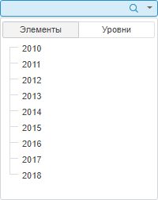

# Пример размещения компонента DimCombo

Пример размещения компонента DimCombo
-

# Пример размещения компонента DimCombo

Перед выполнением примера ознакомьтесь с [рекомендациями](dhtml.chm::/specification/JavaScript_main.htm)
 к написанию кода. Убедитесь, что в репозитории содержится справочник с
 ключом «102770».

Для создания компонента DimCombo
 используйте HTML-код:

<!DOCTYPE html PUBLIC "-//W3C//DTD XHTML 1.0 Transitional//EN" "http://www.w3.org/TR/xhtml1/DTD/xhtml1-transitional.dtd">
<html>
<head>
    <meta http-equiv="X-UA-Compatible" content="IE=edge" />
    <meta http-equiv="Content-Type" content="text/html; charset=UTF-8">
    <title>DimCombo</title>
    
    
    
    <link href="../build/PP.css" rel="stylesheet" type="text/css" />
    <link href="../build/PP.Metabase.css" rel="stylesheet" type="text/css" />
    <link href="../build/PP.App.css" rel="stylesheet" type="text/css" />
</head>
<body>
    

    

    
</body>
</html>

В результате выполнения примера на html-странице будет размещен компонент
 DimCombo, который отображает раскрывающийся список с элементами справочника
 с ключом «102770»:

См. также:

[Классы
 для работы с измерением](../../../Classes/DimClasses.htm)

		Справочная
		 система на версию 10.9
		 от 18/08/2025,
		 © ООО «ФОРСАЙТ»,
