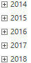

# Пример создания компонента DimTree

Пример создания компонента DimTree
-

# Пример создания компонента DimTree

Перед выполнением примера ознакомьтесь с [рекомендациями](dhtml.chm::/specification/JavaScript_main.htm)
 к написанию кода. Убедитесь, что в репозитории содержится справочник с
 ключом «102770».

Для создания компонента DimTree
 используйте HTML-код:

<!DOCTYPE html PUBLIC "-//W3C//DTD XHTML 1.0 Transitional//EN" "http://www.w3.org/TR/xhtml1/DTD/xhtml1-transitional.dtd">
<html>
<head>
    <meta http-equiv="X-UA-Compatible" content="IE=edge" />
    <meta http-equiv="Content-Type" content="text/html; charset=UTF-8">
    <title>DimTree</title>
    
    
    
    
    
    
    

    
</head>
<body onload="onLoad()">
    

</body>
</html>

В результате выполнения примера на html-странице будет размещен компонент
 DimTree, который отображает дерево элементов справочника с ключом «102770»:

Для данного дерева отключена возможность множественной отметки элементов.

См. также:

[DimTree](DimTree.htm)

		Справочная
		 система на версию 10.9
		 от 18/08/2025,
		 © ООО «ФОРСАЙТ»,
