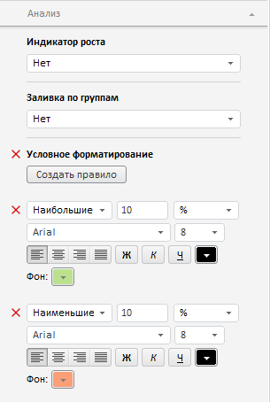

# Конструктор AnalysisPanel

Конструктор AnalysisPanel
-

**

# Конструктор AnalysisPanel

## Синтаксис

PP.Exp.Ui.AnalysisPanel(settings);

## Параметры

*settings.* JSON-объект
 со значениями свойств компонента.

## Описание

Конструктор AnalysisPanel**
 создает экземпляр класса **AnalysisPanel**.

## Пример

Для выполнения примера необходимо наличие на html-странице компонента
 [ExpressBox](../ExpressBox/ExpressBox.htm) с наименованием
 «expressBox» (см. [Пример
 создания компонента ExpressBox](../../../Components/Express/ExpressBox/ExpressBox_Example.htm)). Далее создадим вкладку «Анализ» и
 добавим ее на панель свойств экспресс-отчета:

// Получаем панель свойств экспресс-отчета
var propBar = expressBox.getPropertyBarView().getControl();
// Создаем вкладку «Анализ»
var analysisPanel = new PP.Exp.Ui.AnalysisPanel({
     Source: expressBox.getSource(),
     ImagePath: "../Img/",
     ViewType: PP.Ui.NavigationItem,
     GroupName: PP.Exp.Ui.PropertyGroups.Table
});
// Добавляем вкладку «Анализ» на панель свойств
propBar.addItem(analysisPanel);

В результате выполнения примера на панели свойств экспресс-отчета будет
 создана вкладка «Анализ»:

См. также:

[AnalysisPanel](AnalysisPanel.htm)

		Справочная
		 система на версию 10.9
		 от 18/08/2025,
		 © ООО «ФОРСАЙТ»,
