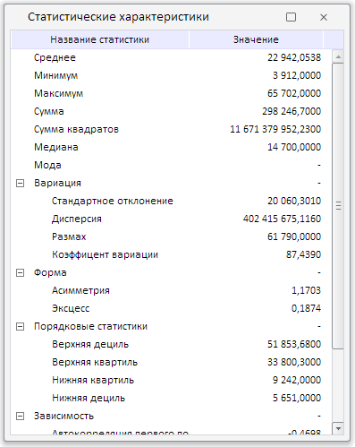

# BubbleTreeBox.showStatisticsWindow

BubbleTreeBox.showStatisticsWindow
-

# BubbleTreeBox.showStatisticsWindow

## Синтаксис

showStatisticsWindow();

## Описание

Метод showStatisticsWindow отображает окно «Статистические характеристики».

## Пример

Для выполнения примера необходимо наличие на html-странице компонента [BubbleTreeBox](../../../Components/Express/BubbleTreeBox/BubbleTreeBox.htm) с наименованием «bubbleTreeBox» (см. «[Пример создания компонента BubbleTreeBox](../../../Components/Express/TreeMapBox/TreeMapBox_Example.htm)»). Отобразим окно «Статистические характеристики»:

bubbleTreeBox.showStatisticsWindow();

В результате выполнения примера для текущих данных контейнера пузырькового дерева было отображено окно с их статистическими характеристиками:

См. также:

[BubbleTreeBox](BubbleTreeBox.htm)

		Справочная
		 система на версию 10.9
		 от 18/08/2025,
		 © ООО «ФОРСАЙТ»,
