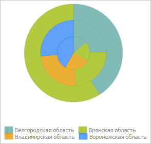

# ChartTypeMenu.chartTypeChange

ChartTypeMenu.chartTypeChange
-

# ChartTypeMenu.chartTypeChange

## Синтаксис

chartTypeChange(listBox: [PP.Ui.ListBox](dhtmlList.chm::/Classes/ListBox/ListBox.htm),
 selectedIndex: Number, fireEvent: Boolean);

## Параметры

listBox. Набор значков, соответствующих
 какой-либо группе типов диаграммы;

selectedIndex. Индекс выбранного значка;

fireEvent. Признак того, нужно
 ли генерировать событие [ChartTypeChanged](ChartTypeMenu.ChartTypeChanged.htm).
 Если параметр равен значению true,
 то данное событие будет сгенерировано, иначе - не будет.

## Описание

Метод chartTypeChange изменяет
 тип диаграммы.

## Пример

Для выполнения примера необходимо наличие на html-странице компонента
 [ExpressBox](../../../Components/Express/ExpressBox/ExpressBox.htm)
 с наименованием «expressBox» (см. «[Пример
 создания компонента ExpressBox](../../../Components/Express/ExpressBox/ExpressBox_Example.htm)») и с загруженной диаграммой в рабочей
 области экспресс-отчета. Преобразуем исходную диаграмму в круговую:

// Получим меню для выбора типа диаграммы
var chartTypeMenu = expressBox.getRibbonView().getChartCategory().getChartTypeMenu();
// Массив значков, соответствующих круговым диаграммам
var pieImages = chartTypeMenu.getPieChartTypeListBox();
// Установим круговую диаграмму
chartTypeMenu.chartTypeChange(pieImages, 0);
В результате выполнения примера исходная диаграмма была преобразована
 в круговую:

См. также:

[ChartTypeMenu](ChartTypeMenu.htm)

		Справочная
		 система на версию 10.9
		 от 18/08/2025,
		 © ООО «ФОРСАЙТ»,
