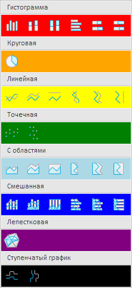

# ChartTypeMenu.getAreaChartTypeListBox

ChartTypeMenu.getAreaChartTypeListBox
-

# ChartTypeMenu.getAreaChartTypeListBox

## Синтаксис

getAreaChartTypeListBox();

## Описание

Метод getAreaChartTypeListBox
 возвращает массив значков, соответствующих диаграммам с областями.

## Комментарии

Метод возвращает значение типа [PP.Ui.ListBox](dhtmlList.chm::/Classes/ListBox/ListBox.htm).

## Пример

Для выполнения примера необходимо наличие на html-странице компонента
 [ExpressBox](../../../Components/Express/ExpressBox/ExpressBox.htm)
 с наименованием «expressBox» (см. «[Пример
 создания компонента ExpressBox](../../../Components/Express/ExpressBox/ExpressBox_Example.htm)») и с загруженной диаграммой в рабочей
 области экспресс-отчета. Отобразим меню для выбора типа диаграммы, снимем
 выделение со значков и раскрасим их разными цветами в зависимости от группы
 типов диаграммы:

// Получим меню для выбора типа диаграммы
var chartTypeMenu = expressBox.getRibbonView().getChartCategory().getChartTypeMenu();
// Отобразим данное меню и сделаем его доступным
chartTypeMenu.show();
chartTypeMenu.setEnabled(true);
// Очистим выделение значков
chartTypeMenu.clearSelection();
var data = []; // Массив значков
var colors = []; // Массив цветов
// Массив значков, соответствующих гистограммам
data[0] = chartTypeMenu.getColumnChartTypeListBox();
colors[0] = PP.Color.Colors.red; // Красный цвет
// Массив значков, соответствующих круговым диаграммам
data[1] = chartTypeMenu.getPieChartTypeListBox();
colors[1] = PP.Color.Colors.orange; // Оранжевый цвет
// Массив значков, соответствующих линейным диаграммам
data[2] = chartTypeMenu.getLineChartTypeListBox();
colors[2] = PP.Color.Colors.yellow; // Жёлтый цвет
// Массив значков, соответствующих точечным диаграммам
data[3] = chartTypeMenu.getScatterChartTypeListBox();
colors[3] = PP.Color.Colors.green; // Зелёный цвет
// Массив значков, соответствующих диаграммам с областями
data[4] = chartTypeMenu.getAreaChartTypeListBox();
colors[4] = PP.Color.Colors.lightblue; // Жёлтый цвет
// Массив значков, соответствующих смешанным диаграммам
data[5] = chartTypeMenu.getMixedChartTypeListBox();
colors[5] = PP.Color.Colors.blue; // Жёлтый цвет
// Массив значков, соответствующих лепестковым диаграммам
data[6] = chartTypeMenu.getRadarChartTypeListBox();
colors[6] = PP.Color.Colors.purple; // Сиреневый цвет
// Массив значков, соответствующих ступенчатым графикам
data[7] = chartTypeMenu.getStepLineChartTypeListBox();
colors[7] = PP.Color.Colors.black; // Чёрный цвет
// Окрасим значки разных групп типов диаграмм в разные цвета
for (var i in data) {
    data[i].setStyle("background-color: " + colors[i]);
};
В результате выполнения примера в экспресс-отчёте было отображено меню
 для выбора типа диаграммы. Значки, соответствующие разным группам типов,
 были окрашены в разные цвета. Выделение с них было снято:

См. также:

[ChartTypeMenu](ChartTypeMenu.htm)

		Справочная
		 система на версию 10.9
		 от 18/08/2025,
		 © ООО «ФОРСАЙТ»,
