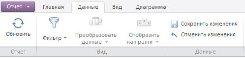
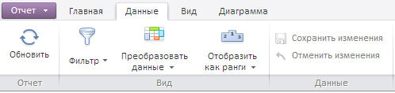

# DataCatView.setEnabledSaveButton

DataCatView.setEnabledSaveButton
-

**

# DataCatView.setEnabledSaveButton

## Синтаксис

setEnabledSaveButton(value);

## Параметры

*value.* Присваиваемое значение.

## Описание

Метод setEnabledSaveButton** управляет доступностью кнопок из группы «Данные» на одноименной вкладке ленты инструментов экспресс-отчёта.

## Пример

Для выполнения примера необходимо наличие на html-странице компонента [ExpressBox](../ExpressBox/ExpressBox.htm) с наименованием «expressBox» (см. [Пример создания компонента ExpressBox](../../../Components/Express/ExpressBox/ExpressBox_Example.htm)). В приведенном ниже примере кнопка «Сохранить изменения» становится недоступной на ленте инструментов экспресс-отчета:

// Получим представление панели ленты инструментов «Данные»
var dataRibbonCategory = expressBox.getRibbonView().getDataRibbonCategory();
// Сделаем кнопки недоступными
dataRibbonCategory.setEnabledSaveButton(false);

До выполнения примера лента инструментов выглядит следующим образом:

После выполнения примера кнопка «Сохранить изменения» на ленте инструментов становится недоступной:

См. также:

[DataCatView](DataCatView.htm)

		Справочная
		 система на версию 10.9
		 от 18/08/2025,
		 © ООО «ФОРСАЙТ»,
