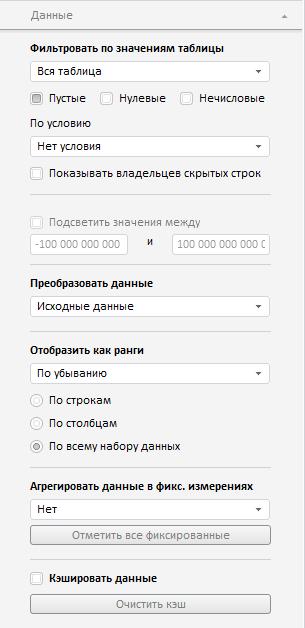

# Конструктор DataPanel

Конструктор DataPanel
-

**

# Конструктор DataPanel

## Синтаксис

PP.Exp.Ui.DataPanel(settings);

## Параметры

*settings.* JSON-объект со значениями свойств компонента.

## Описание

Конструктор DataPanel** создает экземпляр компонента **DataPanel**.

## Пример

Для выполнения примера необходимо наличие на html-странице компонента [ExpressBox](../ExpressBox/ExpressBox.htm) с наименованием «expressBox» (см. [Пример создания компонента ExpressBox](../../../Components/Express/ExpressBox/ExpressBox_Example.htm)). Далее создадим вкладку «Данные» и добавим ее на панель свойств экспресс-отчета:

// Получаем панель свойств экспресс-отчета
var propBar = expressBox.getPropertyBarView().getControl();
// Создаем вкладку «Данные»
var dataPanel = new PP.Exp.Ui.DataPanel({
    Source: expressBox.getSource(),
    GroupName: PP.Exp.Ui.PropertyGroups.Sheet,
    ViewType: PP.Ui.NavigationItem
});
// Добавляем вкладку «Данные» на панель свойств
propBar.addItem(dataPanel);

В результате выполнения примера на панели свойств экспресс-отчета будет создана вкладка «Данные»:

:

См. также:

[DataPanel](DataPanel.htm)

		Справочная
		 система на версию 10.9
		 от 18/08/2025,
		 © ООО «ФОРСАЙТ»,
