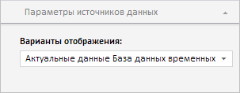

# Конструктор DataSourceParamsPanel

Конструктор DataSourceParamsPanel
-

**

# Конструктор DataSourceParamsPanel

## Синтаксис

PP.Exp.Ui.DataSourceParamsPanel(settings);

## Параметры

*settings.* JSON-объект со значениями свойств класса.

## Описание

Конструктор DataSourceParamsPanel** создает экземпляр класса **DataSourceParamsPanel**.

## Пример

Для выполнения примера необходимо наличие на html-странице компонента [ExpressBox](../ExpressBox/ExpressBox.htm) с наименованием «expressBox» (см. [Пример создания компонента ExpressBox](../../../Components/Express/ExpressBox/ExpressBox_Example.htm)). Далее создадим вкладку «Параметры источников данных» и добавим ее на панель свойств экспресс-отчета:

// Получаем панель свойств экспресс-отчета
var propBar = expressBox.getPropertyBarView().getControl();
// Создаем вкладку «Параметры источников данных»
var dsp = new PP.Exp.Ui.DataSourceParamsPanel({
    Id: PP.Exp.Ui.ControlType.DataSourceParams,
    Source: expressBox.getSource(), // Источник данных
    GroupName: PP.Exp.Ui.PropertyGroups.Sheet,
    ImagePath: "../Img/",
    ViewType: PP.Ui.NavigationItem
});
// Добавляем вкладку «Параметры источников данных» на панель свойств
propBar.addItem(dsp);

В результате выполнения примера на панели свойств экспресс-отчета будет создана вкладка «Параметры источников данных»:

См. также:

[DataSourceParamsPanel](DataSourceParamsPanel.htm)

		Справочная
		 система на версию 10.9
		 от 18/08/2025,
		 © ООО «ФОРСАЙТ»,
