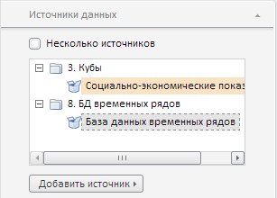

# Конструктор DataSourcesPanel

Конструктор DataSourcesPanel
-

**

# Конструктор DataSourcesPanel

## Синтаксис

PP.Exp.Ui.DataSourcesPanel(settings);

## Параметры

*settings.* JSON-объект со значениями свойств класса.

## Описание

Конструктор DataSourcesPanel** создает экземпляр класса **DataSourcesPanel**.

## Пример

Для выполнения примера необходимо наличие на html-странице компонента [ExpressBox](../ExpressBox/ExpressBox.htm) с наименованием «expressBox» (см. [Пример создания компонента ExpressBox](../../../Components/Express/ExpressBox/ExpressBox_Example.htm)). Далее создадим вкладку «Источники данных» и добавим ее на панель свойств экспресс-отчета:

// Получаем панель свойств экспресс-отчета
var propBar = expressBox.getPropertyBarView().getControl();
// Создаем вкладку «Источники данных»
var dataSourcesPanel = new PP.Exp.Ui.DataSourcesPanel({
    Id: PP.Exp.Ui.ControlType.DataSources,
    Source: expressBox.getSource(),
    GroupName: PP.Exp.Ui.PropertyGroups.Sheet,
    ImagePath: "../Img/",
    ViewType: PP.Ui.NavigationItem,
});
// Добавляем вкладку «Источники данных» на панель свойств
propBar.addItem(dataSourcesPanel);

В результате выполнения примера на панели свойств экспресс-отчета будет создана вкладка «Источники данных»:

См. также:

[DataSourcesPanel](DataSourcesPanel.htm)

		Справочная
		 система на версию 10.9
		 от 18/08/2025,
		 © ООО «ФОРСАЙТ»,
