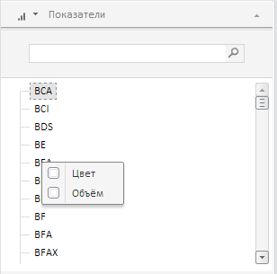

# Конструктор DimIndicatorMP

Конструктор DimIndicatorMP
-

**

# Конструктор DimIndicatorMP

## Синтаксис

PP.Exp.Ui.DimIndicatorMP(settings);

## Параметры

*settings.* JSON-объект со значениями свойств класса.

## Описание

Конструктор DimIndicatorMP** создает экземпляр класса **DimIndicatorMP**.

## Пример

Для выполнения примера необходимо наличие на html-странице компонента [ExpressBox](../ExpressBox/ExpressBox.htm) с наименованием «expressBox» (см. «[Пример создания компонента ExpressBox](../../../Components/Express/ExpressBox/ExpressBox_Example.htm)»). Далее создадим вкладку «Показатели» и добавим ее на панель свойств экспресс-отчета:

var panel;
// Получаем панель свойств экспресс-отчета
var propBar = expressBox.getPropertyBarView().getControl();
// Получаем метаданные
var md = expressBox.getSource().getMetadata();
if (md) {
    var indicDimSource = expressBox.getSource().getDim(md.map.indicatorsDimension ?
        md.map.indicatorsDimension.k : null);
    if (indicDimSource) {
        // Создаем вкладку «Показатели»
        panel = new PP.Exp.Ui.DimIndicatorMP({
            Source: indicDimSource, // Устанавливаем источник данных
            OwnerMaster: expressBox,
            Data: indicDimSource.getKey(),
            Title: indicDimSource.getName(),
            TypeUpdateData: PP.Exp.Ui.ViewTypeUpdate.Map,
            IsRTL: expressBox.getIsRTL()
        });
        // Добавляем вкладку «Показатели» на панель свойств
        propBar.addItem(panel);
    }
}

В результате выполнения примера на панели свойств экспресс-отчета будет создана вкладка «Показатели»:

См. также:

[DimIndicatorMP](DimIndicatorMP.htm)

		Справочная
		 система на версию 10.9
		 от 18/08/2025,
		 © ООО «ФОРСАЙТ»,
