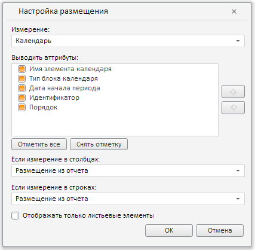

# DimViewOptionsDialog.setCheckedAllAttributes

DimViewOptionsDialog.setCheckedAllAttributes
-

**

# DimViewOptionsDialog.setCheckedAllAttributes

## Синтаксис

setCheckedAllAttributes(value, fireEvent);

## Параметры

*value.* Признак выбора всех атрибутов: если равно значению true, то все атрибуты диалога будут отмеченными, если false - то отметка с них снимается;

*fireEvent.* Определяет, генерировать ли соответствующее событие. Необязательный параметр.

## Описание

Метод setCheckedAllAttributes** отмечает все атрибуты текущего измерения в диалоге для настройки размещения измерений.

## Пример

Для выполнения примера необходимо наличие на html-странице компонента [DimViewOptionsDialog](DimViewOptionsDialog.htm) с наименованием «dimViewOptionsDialog» (см. «[Пример создания компонента DimViewOptionsDialog](../../../Components/Express/DimViewOptionsDialog/DimViewOptionsDialog_Example.htm)»). Отметим все атрибуты текущего измерения в диалоге для настройки размещения измерений:

// Отметим все атрибуты текущего измерения
dimViewOptionsDialog.setCheckedAllAttributes(true, true);
// Обновим диалог
dimViewOptionsDialog.refresh();

В результате выполнения примера будут отмечены все атрибуты измерения :

См. также:

[DimViewOptionsDialog](DimViewOptionsDialog.htm)

		Справочная
		 система на версию 10.9
		 от 18/08/2025,
		 © ООО «ФОРСАЙТ»,
