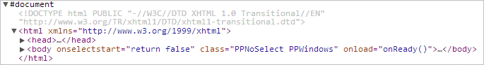

# EaxAnalyzer.Document

EaxAnalyzer.Document
-

**

# EaxAnalyzer.Document

## Синтаксис

Document: Object

## Описание

Свойство Document** содержит html-документ экспресс-отчета.

## Комментарии

Значение свойства устанавливается из JSON и с помощью метода setDocument и возвращается с помощью getDocument.

## Пример

Для выполнения примера необходимо наличие на html-странице компонента [ExpressBox](../../../Components/Express/ExpressBox/ExpressBox.htm) с наименованием «expressBox» (см. «[Пример создания компонента ExpressBox](../../../Components/Express/ExpressBox/ExpressBox_Example.htm)»). Далее получим содержимое html-документа экспресс-отчета:

var eaxAnalyzer = expressBox.getSource();
var document = eaxAnalyzer.getDocument();
if(document != null) {
    // Выведем содержимое html-документа
    console.log(document);
} else
{
    console.log("Содержимое html-документа не получено.");
}

В результате выполнения примера в консоли браузера будет выведено содержимое html-документа экспресс-отчета:

См. также:

[EaxAnalyzer](EaxAnalyzer.htm)

		Справочная
		 система на версию 10.9
		 от 18/08/2025,
		 © ООО «ФОРСАЙТ»,
