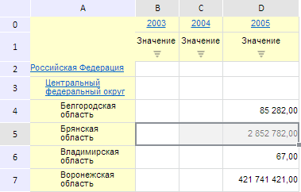

# EaxAnalyzer.GridSelectionType

EaxAnalyzer.GridSelectionType
-

**

# EaxAnalyzer.GridSelectionType

## Синтаксис

GridSelectionType: String

## Описание

Свойство GridSelectionType** содержит тип выделенного объекта в таблице экспресс-отчета.

## Комментарии

Значение свойства устанавливается из JSON с помощью метода setGridSelectionType и возвращается с помощью getGridSelectionType.

## Пример

Для выполнения примера необходимо наличие на html-странице компонента [ExpressBox](../../../Components/Express/ExpressBox/ExpressBox.htm) с наименованием «expressBox» (см. «[Пример создания компонента ExpressBox](../../../Components/Express/ExpressBox/ExpressBox_Example.htm)») и с загруженной таблицей в рабочей области экспресс-отчета. Установим тип выделения, равный значению «row», и затем выделим пятую строку в таблице:

var eaxAnalyzer = expressBox.getSource();
// Функция для выделения строк и столбцов таблицы по индексу
var selectRange = function (index) {
    var gridView = expressBox.getDataView().getGridView();
    switch (eaxAnalyzer.getGridSelectionType()) {
        case "Row":
            // Выделим строку таблицы с указанным индексом
            gridView.setSelection({
                range: {
                    height: 1,
                    width: gridView.getTabSheet().getMeasures().getMaxColumn(),
                    left: 1, top: index
                },
                type: "Normal"
            });
            break;
        case "Column":
            // Выделим столбец таблицы с указанным индексом
            gridView.setSelection({
                range: {
                    height: gridView.getTabSheet().getMeasures().getMaxRow(),
                    width: 1, left: index, top: 1
                },
                type: "Normal"
            });
            break;
    }
};
// Установим тип выделенных элементов таблицы экспресс-отчета
eaxAnalyzer.setGridSelectionType("Row");
// Выделим строку с индексом 5
this.selectRange(5);

В результате выполнения примера в таблице экспресс-отчета была выделена пятая строка:

См. также:

[EaxAnalyzer](EaxAnalyzer.htm)

		Справочная
		 система на версию 10.9
		 от 18/08/2025,
		 © ООО «ФОРСАЙТ»,
