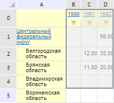

# EaxAnalyzer.transposeSelection

EaxAnalyzer.transposeSelection
-

**

# EaxAnalyzer.transposeSelection

## Синтаксис

transposeSelection();

## Описание

Метод transposeSelection**
 транспонирует диапазон выделенных ячеек в таблице экспресс-отчета.

## Пример

Для выполнения примера необходимо наличие на html-странице компонента
 [ExpressBox](../../../Components/Express/ExpressBox/ExpressBox.htm)
 с наименованием «expressBox» (см. «[Пример
 создания компонента ExpressBox](../../../Components/Express/ExpressBox/ExpressBox_Example.htm)») и с загруженной таблицей в рабочей
 области экспресс-отчёта. Выделим диапазон ячеек и транспонируем его на
 уровне модели таблицы:

var eaxAnalyzer = expressBox.getSource();
// Получим таблицу экспресс-отчёта
var tabSheet = expressBox.getDataView().getGridView().getTabSheet();
// Выделим ячейки таблицы
tabSheet.select(tabSheet.getRange(1, 0, 3, 4));
// Зададим функцию для определения диапазона выделенных ячеек таблицы
var getSelection = function (range) {
    var left = range.left;
    var top = range.top;
    var right = left + range.width;
    var bottom = top + range.height;
    var selection = "(" + left + ", " + top + ")-(" + right + ", " + bottom + ")";
    return selection;
}
// Определим выделенный диапазон в таблице экспресс-отчёта
var range = eaxAnalyzer.getSelection().range.parts.it[0];
console.log("Диапазон выделенных ячеек до транспонирования: " + this.getSelection(range));
// Транспонируем выделение
eaxAnalyzer.transposeSelection();
console.log("Диапазон выделенных ячеек после транспонирования: " + this.getSelection(range));

В результате выполнения примера был выделен диапазон ячеек B0-D4:

В консоли браузера был выведен диапазон выделенных ячеек до и после
 его транспонирования:

Диапазон выделенных ячеек до транспонирования: (1,
 0)-(4, 5)

Диапазон выделенных ячеек после транспонирования: (0, 1)-(5, 4)

См. также:

[EaxAnalyzer](EaxAnalyzer.htm)

		Справочная
		 система на версию 10.9
		 от 18/08/2025,
		 © ООО «ФОРСАЙТ»,
